<section id="overview">
  <h2 id="overview">Overview</h2>
  

    This project explores how frequency-based filtering and pyramid representations shape the way we analyze and blend images. Beginning with edge detection and sharpening, I examined how finite differences, derivative-of-Gaussian filters, and unsharp masking isolate or enhance different frequency bands. Extending these ideas, I built hybrid images that reveal one subject up close and another from afar, then used Gaussian and Laplacian stacks to study image structure across scales. Finally, I applied multiresolution blending, where blurred masks and Laplacian pyramids allow two photographs to merge seamlessly. Together, these experiments highlight how simple linear filters and coarse-to-fine analysis can both explain visual perception and enable striking composite effects.
  

  

    All figures live in <code>cs180/proj2/assets/</code>.
  

</section>

<section id="part1">
  <h2 id="part1">Part 1 — Fun with Filters</h2>

  <section id="part1-1">
    <h3>1.1 Convolutions from Scratch</h3>
    

      I implemented 2D convolution from first principles. I began with a <em>four-loop</em> version
      (over image rows/cols and kernel rows/cols) using <strong>zero padding</strong>, then reduced it to a
      <em>two-loop</em> version by pre-flipping the kernel and using vectorized dot products over each local patch.
      I verified numerical correctness against <code>scipy.signal.convolve2d</code> (mode=<code>'same'</code>, boundary=<code>'fill'</code>, fillvalue=<code>0</code>).
    

    

      <h4>Core idea</h4>
      <pre><code class="language-python">
  def convolve2d_4loops(img, kernel):
    H, W = img.shape
    kh, kw = kernel.shape
    py, px = kh // 2, kw // 2

    padded = pad_zero(img, py, px)
    out = np.zeros_like(img)

    for y in range(H):
        for x in range(W):
            res = 0.0
            for dy in range(kh):
                for dx in range(kw):
                    res += padded[y + dy, x + dx] * kernel[dy, dx]
            out[y, x] = res
    
    return out

  def convolve2d_2loops(img, kernel):
    H, W = img.shape
    kh, kw = kernel.shape
    py, px = kh // 2, kw // 2

    padded = pad_zero(img, py, px)
    out = np.zeros_like(img)

    for y in range(H):
        for x in range(W):
            window = padded[y:y+kh, x:x+kw]
            out[y, x] = np.sum(window * kernel)

    return out

      </code></pre>
    

    
    

      I tested my convolution implementation on a grayscale selfie using three methods.
      The naïve four-loop version took about <strong>63 seconds</strong>, the optimized two-loop version about
      <strong>10 seconds</strong>, and the built-in <code>scipy.signal.convolve2d</code> only <strong>0.5 seconds</strong>,
      illustrating a large performance gap between approaches.
    

    <h4>Box filter</h4>
    

      A box (mean) filter replaces each pixel with the average of its neighbors. For a 9&times;9 box,
      each output is the average of an 81-pixel window. This smooths noise and fine texture while preserving overall
      structure&mdash;at first glance the image looks similar, but edges and skin detail are noticeably softened.
    

    

      <figure>
        
        <figcaption>Original (grayscale)</figcaption>
      </figure>
      <figure>
        
        <figcaption>After 9&times;9 box filter (fine details blurred)</figcaption>
      </figure>
    

    <h4>Finite difference operators Dx, Dy</h4>
    

      The finite difference kernels approximate horizontal (Dx) and vertical (Dy) derivatives and therefore highlight
      intensity changes (edges). The Dx response emphasizes vertical edges (it measures horizontal changes), while
      Dy emphasizes horizontal edges.
    

    

      <figure>
        
        <figcaption>Horizontal derivative (Dx)&nbsp;&mdash; shows vertical edges</figcaption>
      </figure>
      <figure>
        
        <figcaption>Vertical derivative (Dy)&nbsp;&mdash; shows horizontal edges</figcaption>
      </figure>
    

    

      Padding is zero-fill to match the assignment and <code>convolve2d(..., boundary='fill', fillvalue=0)</code>.
      Values are processed in float and clipped only when saving for display.
    

  </section>

  <section id="part1-2">
    <h3 id="part1-2">1.2 Finite Difference Operator</h3>
    

      I applied horizontal and vertical finite-difference kernels <code>[-1, 1]</code> and its transpose to the classic Cameraman image.
      Taking the absolute gradient magnitude reveals strong edges, but direct differencing amplifies sensor noise. Thresholding the
      magnitude at 0.18 produces a binary edge map aligned with textbook results.
    

    

      <article class="card"><figure>
        
        <figcaption>Input.</figcaption>
      </figure></article>
      <article class="card"><figure>
        
        <figcaption>Horizontal derivative.</figcaption>
      </figure></article>
      <article class="card"><figure>
        
        <figcaption>Vertical derivative.</figcaption>
      </figure></article>
      <article class="card"><figure>
        
        <figcaption>Gradient magnitude (note amplified noise).</figcaption>
      </figure></article>
      <article class="card"><figure>
        
        <figcaption>Binary edge map (threshold&nbsp;&approx;&nbsp;0.18).</figcaption>
      </figure></article>
    

  </section>

  <section id="part1-3">
    <h3 id="part1-3">1.3 Derivative of Gaussian (DoG) Filter</h3>
    

      Blurring before differentiating damps high-frequency noise. Instead of a two-pass blur-then-differentiate, I convolve the
      finite-difference filters with a Gaussian (&#963; = 1.0) to produce derivative-of-Gaussian kernels. Using DoG drastically cleans
      up the gradient magnitude while preserving edge localization, so the binarized edge map is much smoother than the direct
      difference result.
    

    

      <article class="card"><figure>
        
        <figcaption>d/dx of Gaussian kernel.</figcaption>
      </figure></article>
      <article class="card"><figure>
        
        <figcaption>d/dy of Gaussian kernel.</figcaption>
      </figure></article>
      <article class="card"><figure>
        
        <figcaption>Edges after DoG + thresholding. Noise is greatly reduced.</figcaption>
      </figure></article>
    

  </section>
</section>

<section id="part2">
  <h2 id="part2">Part 2 — Fun with Frequencies</h2>

  <section id="part2-1">
    <h3 id="part2-1">2.1 Image sharpening</h3>
    

      I implemented unsharp masking by subtracting a Gaussian blur (&#963; = 2) scaled by an amount <code>&alpha;</code> from the original image.
      The tree example uses <code>&alpha; = 1.0</code>, while the Taj Mahal and the Berkeley hills panorama explore stronger settings of 3 and 6.
      The blurred intermediate and isolated high frequencies help visualize what gets amplified.
    

    

      <figure>
        
        <figcaption>Tree — original.</figcaption>
      </figure>
      <figure>
        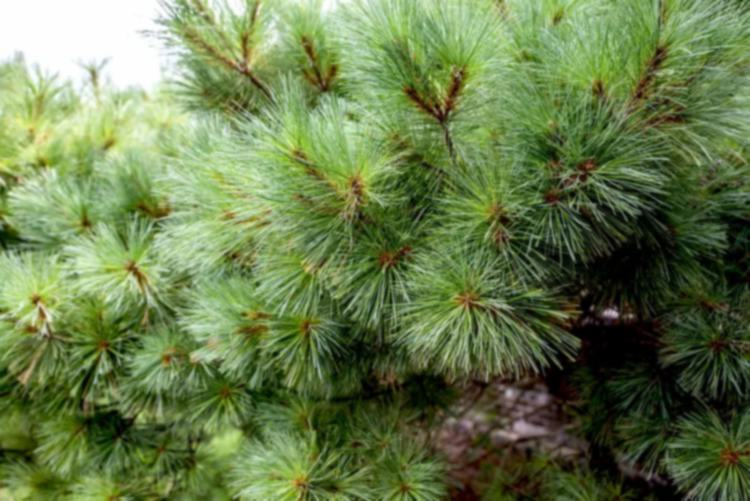
        <figcaption>Gaussian blur (&#963; = 2).</figcaption>
      </figure>
    

    

      <figure>
        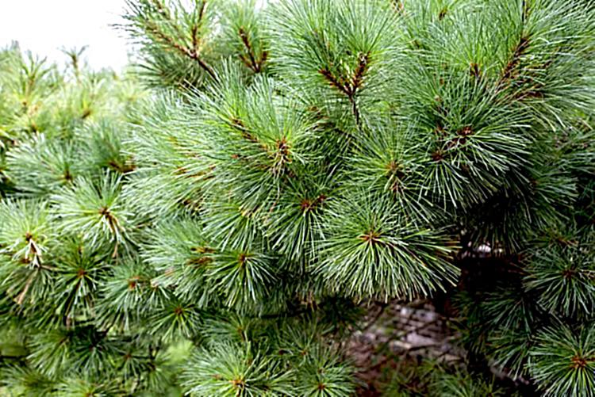
        <figcaption>Sharpened result (&#945;=1.0).</figcaption>
      </figure>
      <figure>
        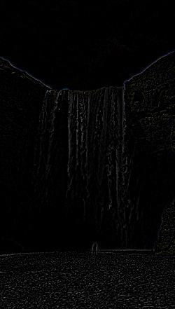
        <figcaption>Extracted high-frequency layer for the hills panorama.</figcaption>
      </figure>
    

    

      <article class="card"><figure>
        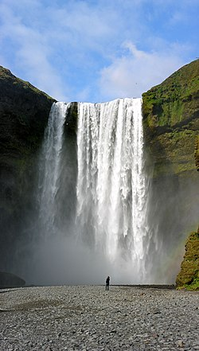
        <figcaption>Panorama — original.</figcaption>
      </figure></article>
      <article class="card"><figure>
        
        <figcaption>Blurred baseline.</figcaption>
      </figure></article>
      <article class="card"><figure>
        
        <figcaption>Sharpened with &#945;=1.0.</figcaption>
      </figure></article>
      <article class="card"><figure>
        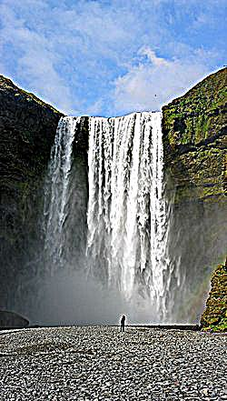
        <figcaption>Sharpened with &#945;=3.0 (crisper but slightly haloed).</figcaption>
      </figure></article>
      <article class="card"><figure>
        
        <figcaption>Taj Mahal — original.</figcaption>
      </figure></article>
      <article class="card"><figure>
        
        <figcaption>&#945;=3.0 (balanced).</figcaption>
      </figure></article>
      <article class="card"><figure>
        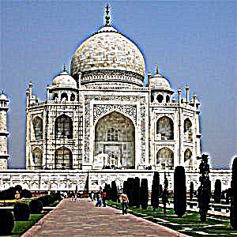
        <figcaption>&#945;=6.0 (aggressive, halos visible).</figcaption>
      </figure></article>
    

  </section>

  <section id="part2-2">
    <h3 id="part2-2">2.2 Hybrid images</h3>
    

      Hybrid images combine low frequencies from one subject with high frequencies from another. My pipeline aligns each pair,
      applies Gaussian low-pass/high-pass filters (cutoffs around 9–11 pixels), and recombines them. Viewing up close reveals the
      high-frequency subject; stepping back reveals the low-frequency subject. I include frequency-magnitude plots for one pair to
      show how information occupies complementary bands.
    

    <h4 id="hybrid-derek">Derek &amp; Nutmeg</h4>
    

      <figure>
        
        <figcaption>Derek (low frequencies).</figcaption>
      </figure>
      <figure>
        
        <figcaption>Nutmeg (high frequencies).</figcaption>
      </figure>
    

    

      <figure>
        
        <figcaption>Hybrid result — Nutmeg up close, Derek from afar.</figcaption>
      </figure>
      <figure>
        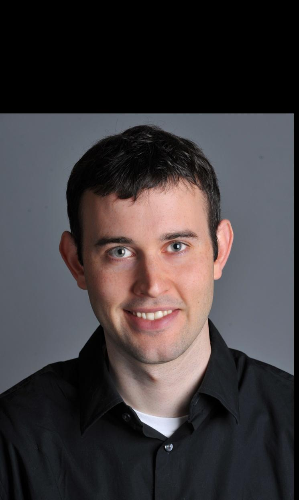
        <figcaption>Alignment overlay check (channels stacked).</figcaption>
      </figure>
    

    <h4 id="hybrid-binotto">Frederic Vasseur &amp; Binotto the Clown</h4>
    

      This playful pair uses a low-pass portrait of Ferrari team principal Frédéric Vasseur and the high-pass features of a clown.
      The combination exaggerates the smile and hat while keeping the lighting from the portrait.
    

    

      <article class="card"><figure>
        
        <figcaption>Low-pass portrait.</figcaption>
      </figure></article>
      <article class="card"><figure>
        
        <figcaption>High-pass clown details.</figcaption>
      </figure></article>
      <article class="card"><figure>
        
        <figcaption>Hybrid — the clown grin mapped onto Binotto.</figcaption>
      </figure></article>
    

    <h4 id="hybrid-sauber">Sauber C44 &amp; Tractor</h4>
    

      Motorsports meets farming equipment: the low frequencies come from a Sauber C44 Formula&nbsp;1 car, the high frequencies from a
      tractor. The FFT visualizations confirm the low-pass filter concentrates energy near the origin while the high-pass spectrum
      surrounds it with a hollow annulus.
    

    

      <article class="card"><figure>
        
        <figcaption>Sauber (low frequency).</figcaption>
      </figure></article>
      <article class="card"><figure>
        
        <figcaption>Tractor (high frequency).</figcaption>
      </figure></article>
      <article class="card"><figure>
        
        <figcaption>Hybrid — from afar it reads as the car.</figcaption>
      </figure></article>
    

    

      <article class="card"><figure>
        
        <figcaption>Low-pass FFT (energy near DC).</figcaption>
      </figure></article>
      <article class="card"><figure>
        
        <figcaption>Source FFT with broader support.</figcaption>
      </figure></article>
      <article class="card"><figure>
        
        <figcaption>Hybrid FFT, combining both bands.</figcaption>
      </figure></article>
      <article class="card"><figure>
        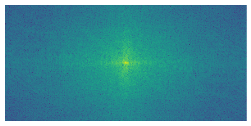
        <figcaption>High-pass FFT (hollow annulus).</figcaption>
      </figure></article>
    

  </section>

  <section id="part2-3">
    <h3 id="part2-3">2.3 Gaussian and Laplacian stacks</h3>
    

      I constructed nine-level Gaussian and Laplacian stacks for the classic apple-or-orange example. Each subsequent Gaussian level
      downsamples by a factor of two, while the Laplacian levels capture band-pass information (Gaussian level minus the next level
      upsampled). The matched stack stores the mask at each scale so blending can be performed consistently.
    

    

      <figure>
        
        <figcaption>Blend target: apple on the left, orange on the right.</figcaption>
      </figure>
      <figure>
        
        <figcaption>Source A (apple).</figcaption>
      </figure>
    

    

      <figure>
        
        <figcaption>Source B (orange).</figcaption>
      </figure>
      <figure>
        
        <figcaption>Mask level&nbsp;0 (full resolution).</figcaption>
      </figure>
    

    
Representative stack levels (top row: Gaussian, middle row: Laplacian, bottom row: mask).

    

      <figure>
        
        <figcaption>Gaussian L0</figcaption>
      </figure>
      <figure>
        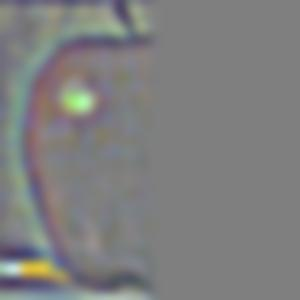
        <figcaption>Gaussian L3</figcaption>
      </figure>
      <figure>
        
        <figcaption>Gaussian L6</figcaption>
      </figure>
      <figure>
        
        <figcaption>Laplacian L0</figcaption>
      </figure>
      <figure>
        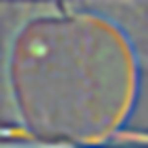
        <figcaption>Laplacian L3</figcaption>
      </figure>
      <figure>
        
        <figcaption>Laplacian L6</figcaption>
      </figure>
      <figure>
        
        <figcaption>Mask L3</figcaption>
      </figure>
      <figure>
        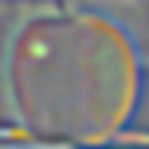
        <figcaption>Mask L6</figcaption>
      </figure>
      <figure>
        
        <figcaption>Mask L8</figcaption>
      </figure>
    

  </section>

  <section id="part2-4">
    <h3 id="part2-4">2.4 Multiresolution blending</h3>
    

      With stacks in place, blending becomes a per-level interpolation followed by reconstruction. I produced two blends: Apple-or-
      Orange (the classic example) and two custom composites — Foothill sunset stitched across a city skyline and a hand holding the
      Earth. The Laplacian and mask stacks confirm that only band-limited seams appear in the final image.
    

    <h4 id="blend-apple">Apple &amp; Orange</h4>
    

      <figure>
        
        <figcaption>Source A.</figcaption>
      </figure>
      <figure>
        
        <figcaption>Source B.</figcaption>
      </figure>
    

    

      <figure>
        
        <figcaption>Feathered vertical mask.</figcaption>
      </figure>
      <figure>
        
        <figcaption>Final blend — smooth transition across the seam.</figcaption>
      </figure>
    

    <h4 id="blend-foothill">Foothill Skyline</h4>
    

      I blended two Berkeley skyline shots captured minutes apart. The stack visualizations show how the Laplacian bands capture
      cloud texture while the mask concentrates along the seam to avoid ghosting.
    

    

      <article class="card"><figure>
        
        <figcaption>Left image (golden hour).</figcaption>
      </figure></article>
      <article class="card"><figure>
        
        <figcaption>Right image (blue hour).</figcaption>
      </figure></article>
      <article class="card"><figure>
        
        <figcaption>Final blend.</figcaption>
      </figure></article>
    

    

      <article class="card"><figure>
        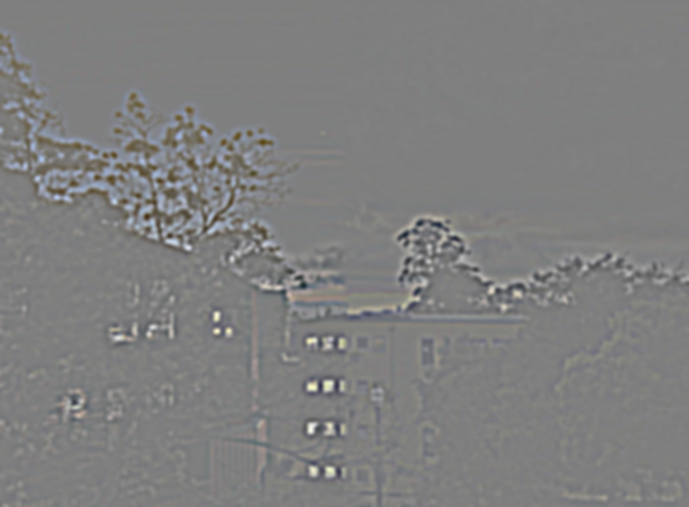
        <figcaption>Mask level&nbsp;2 (feathered seam).</figcaption>
      </figure></article>
      <article class="card"><figure>
        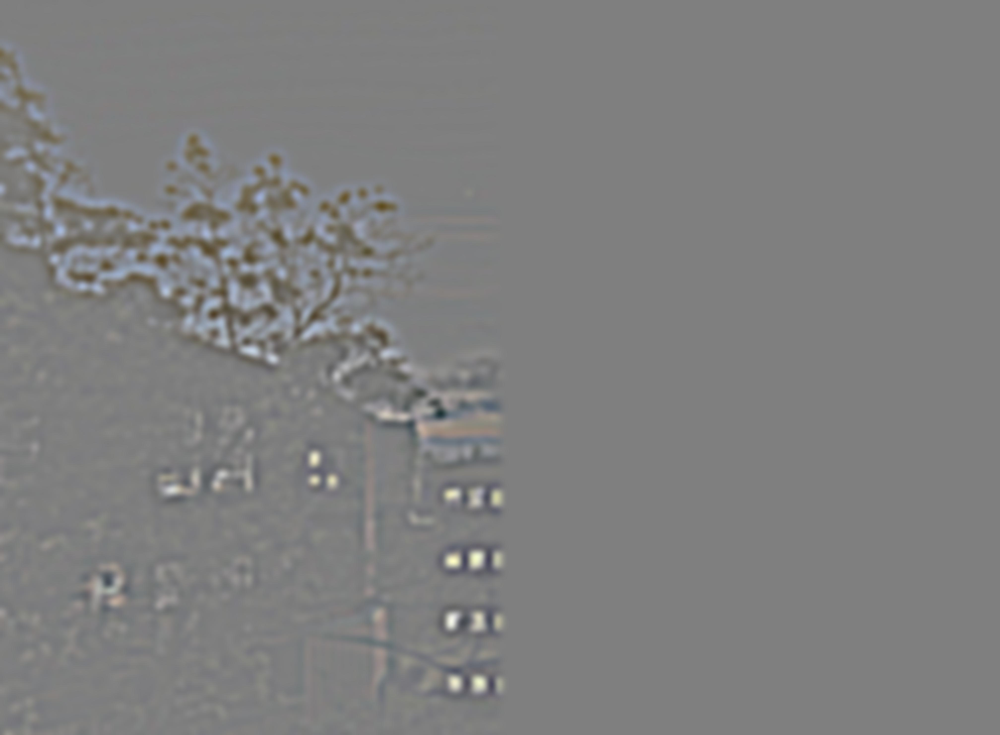
        <figcaption>Left Laplacian level&nbsp;3.</figcaption>
      </figure></article>
      <article class="card"><figure>
        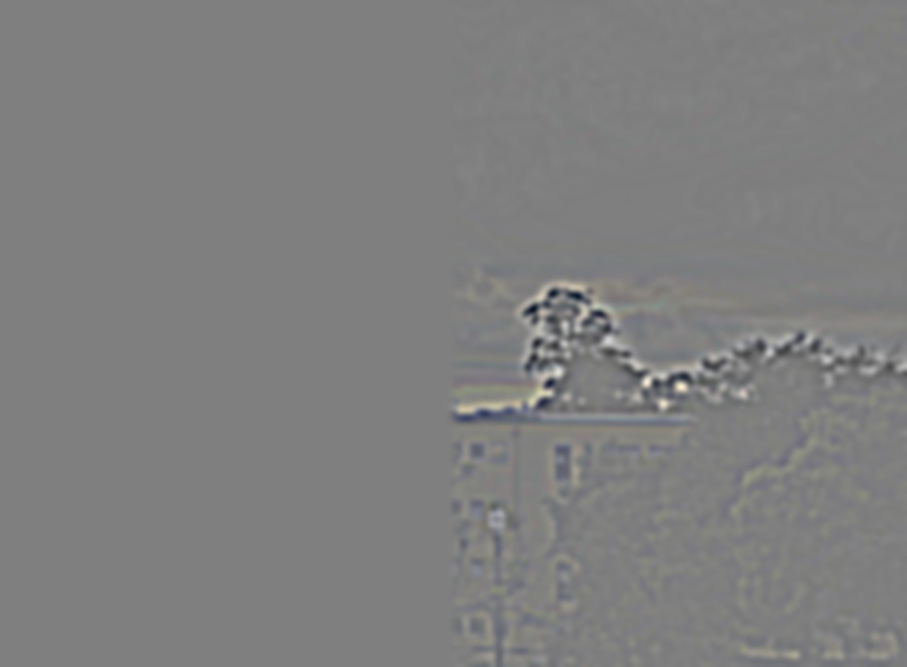
        <figcaption>Right Laplacian level&nbsp;3.</figcaption>
      </figure></article>
    

    <h4 id="blend-hand">Hand &amp; Earth</h4>
    

      For a more dramatic composite, I blended a rendered Earth with a studio-lit hand using a radial mask. Higher Laplacian levels
      capture the planetary highlights without introducing seams along the fingers.
    

    

      <article class="card"><figure>
        
        <figcaption>Hand — level 0.</figcaption>
      </figure></article>
      <article class="card"><figure>
        
        <figcaption>Earth — level 0.</figcaption>
      </figure></article>
      <article class="card"><figure>
        
        <figcaption>Final blend.</figcaption>
      </figure></article>
    

    

      <article class="card"><figure>
        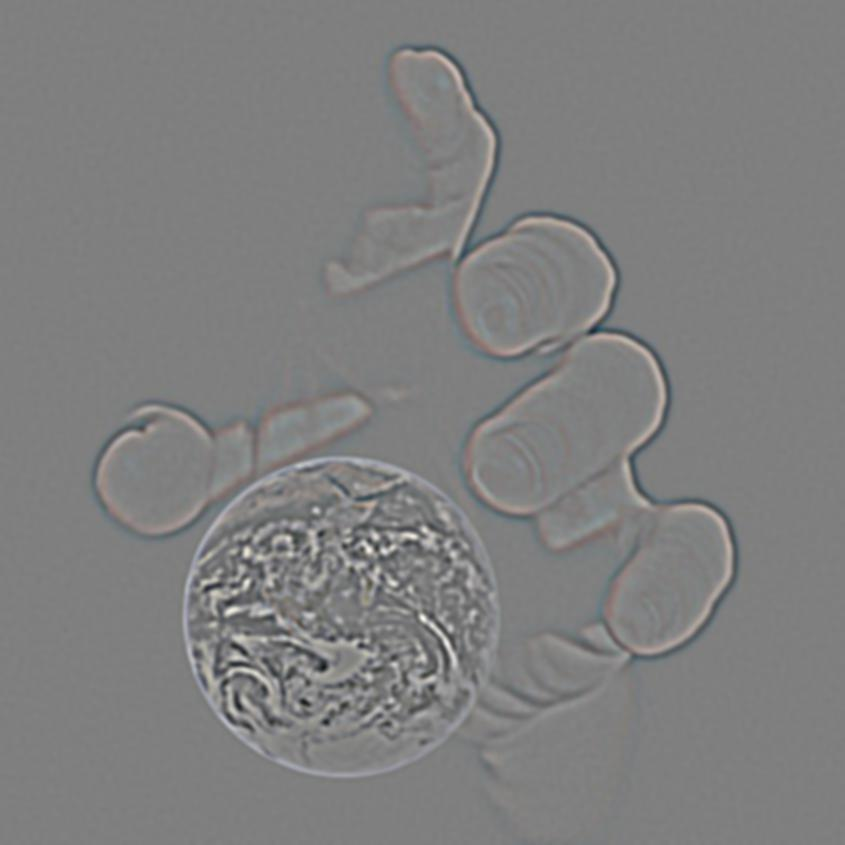
        <figcaption>Mask level&nbsp;2 (radial feather).</figcaption>
      </figure></article>
      <article class="card"><figure>
        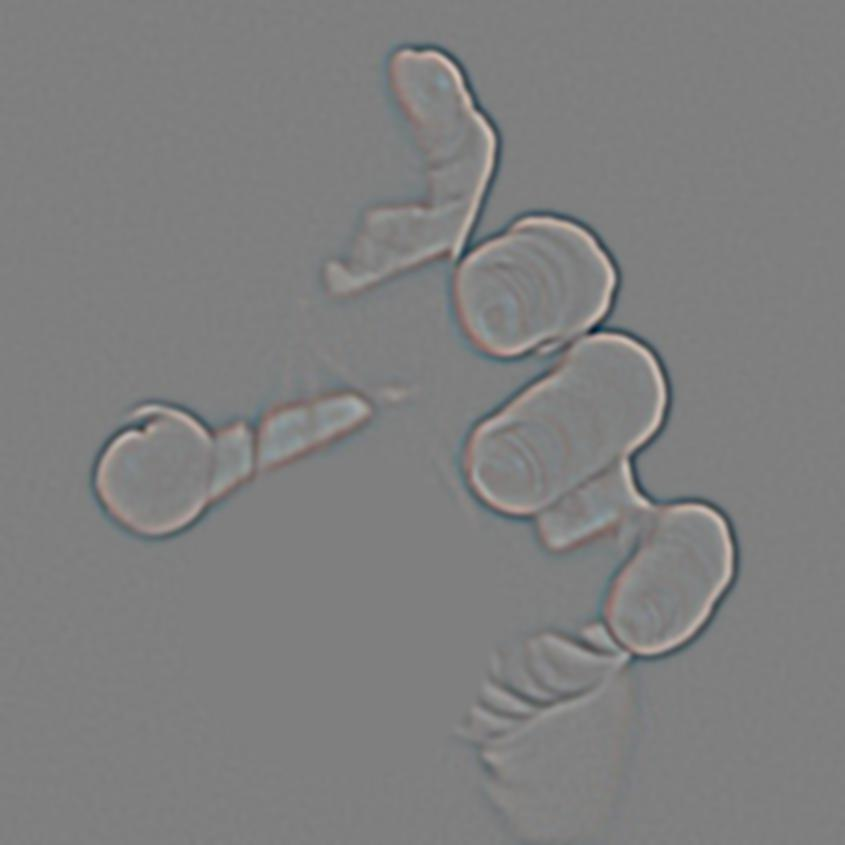
        <figcaption>Hand Laplacian level&nbsp;3.</figcaption>
      </figure></article>
      <article class="card"><figure>
        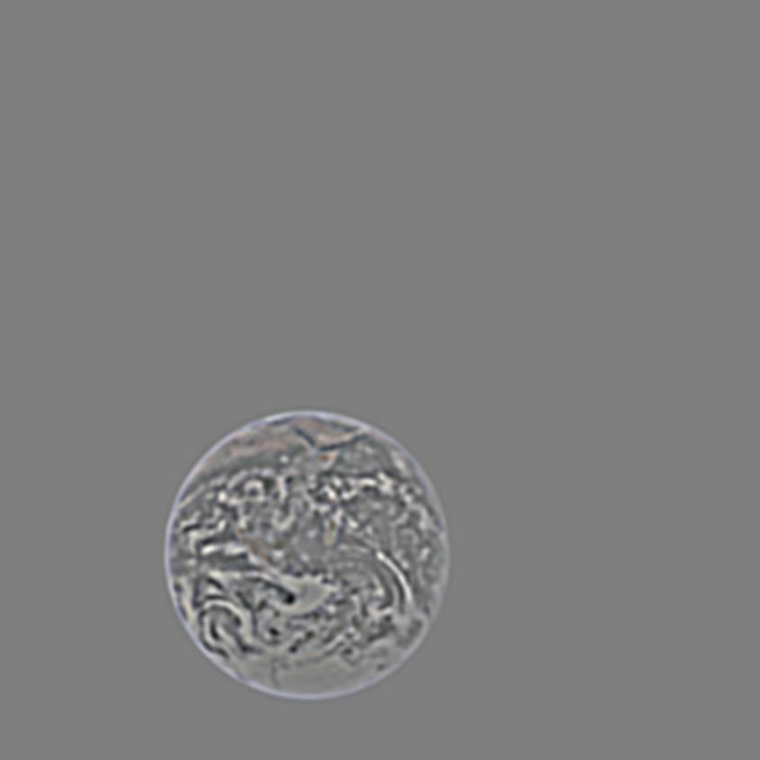
        <figcaption>Earth Laplacian level&nbsp;3.</figcaption>
      </figure></article>
    

  </section>
</section>

<section id="bells">
  <h2 id="bells">Bells &amp; Whistles</h2>
  

    I plan to explore color-space sharpening (performing unsharp masking in LAB instead of RGB) and potentially Poisson blending for
    more natural composites. Results will be added here if time permits.
  

</section>

<section id="reflection">
  <h2 id="reflection">Discussion &amp; Reflection</h2>
  

    Working in the frequency domain makes it clear why simple convolution tricks create powerful perceptual effects. High-frequency
    halos appear quickly if the sharpening amount is too large, and hybrid images depend critically on spatial alignment before
    filtering. Multiresolution blending was the most satisfying deliverable: once the stacks are built, swapping in new sources and
    masks becomes a one-line change.
  

  

    One challenge was selecting consistent thresholds and mask feather widths so binary decisions do not introduce seams. Future
    improvements include adaptive thresholding for edge detection and automated alignment (e.g., phase correlation) to streamline
    hybrid image creation.
  

</section>

<section id="assets">
  <h2 id="assets">Assets &amp; Downloads</h2>
  <ul>
    <li><a href="./assets/">Full-resolution figures and intermediate levels</a></li>
    <li>Source notebooks and scripts (to be linked after cleanup)</li>
  </ul>
</section>
