<section id="overview">
  <h2 id="overview">Overview</h2>
  

    This project explores how frequency-based filtering and pyramid representations shape the way we analyze and blend images. Beginning with edge detection and sharpening, I examined how finite differences, derivative-of-Gaussian filters, and unsharp masking isolate or enhance different frequency bands. Extending these ideas, I built hybrid images that reveal one subject up close and another from afar, then used Gaussian and Laplacian stacks to study image structure across scales. Finally, I applied multiresolution blending, where blurred masks and Laplacian pyramids allow two photographs to merge seamlessly. Together, these experiments highlight how simple linear filters and coarse-to-fine analysis can both explain visual perception and enable striking composite effects.
  

  

    All figures live in <code>cs180/proj2/assets/</code>.
  

  <h2>A Gift to Formula&nbsp;1 Fans</h2>
  

    As a Formula&nbsp;1 fan, I couldn’t resist applying hybrid images to some iconic memes.
    These two examples show how low- and high-frequency components combine to make visuals
    that are funny up close and far away.
  

  

    <figure>
      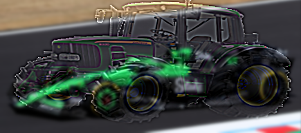
      <figcaption>Hybrid: Sauber C44 body with green tractor detail.</figcaption>
    </figure>
    <figure>
      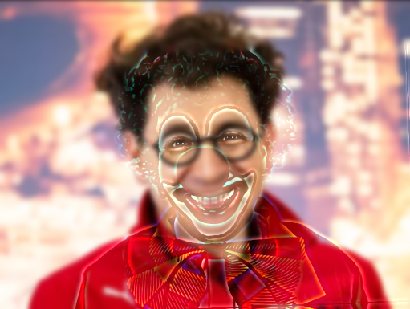
      <figcaption>Hybrid: Mattia Binotto up close, clown from a distance.</figcaption>
    </figure>
  

</section>

<section id="part1">
  <h2 id="part1">Part 1 — Fun with Filters</h2>

  <section id="part1-1">
    <h3>1.1 Convolutions from Scratch</h3>
    

      I implemented 2D convolution from first principles. I began with a <em>four-loop</em> version
      (over image rows/cols and kernel rows/cols) using zero padding, then reduced it to a
      <em>two-loop</em> version using vectorized dot products over each local patch.
      I verified numerical correctness against <code>scipy.signal.convolve2d</code> (mode=<code>'same'</code>, boundary=<code>'fill'</code>, fillvalue=<code>0</code>).
    

    

      <h4>Core idea</h4>
      <pre><code class="language-python">
  def pad_zero(img, pad_y, pad_x):
  """Helper function to pad zero around image"""
    return np.pad(img, ((pad_y, pad_y), (pad_x, pad_x)), mode='constant')
  
  def convolve2d_4loops(img, kernel):
    H, W = img.shape
    kh, kw = kernel.shape
    py, px = kh // 2, kw // 2

    padded = pad_zero(img, py, px)
    out = np.zeros_like(img)

    for y in range(H):
        for x in range(W):
            res = 0.0
            for dy in range(kh):
                for dx in range(kw):
                    res += padded[y + dy, x + dx] * kernel[dy, dx]
            out[y, x] = res
    return out

  def convolve2d_2loops(img, kernel):
    H, W = img.shape
    kh, kw = kernel.shape
    py, px = kh // 2, kw // 2

    padded = pad_zero(img, py, px)
    out = np.zeros_like(img)

    for y in range(H):
        for x in range(W):
            window = padded[y:y+kh, x:x+kw]
            out[y, x] = np.sum(window * kernel)
    return out

      </code></pre>
    

    
    

      I tested my convolution implementation on a grayscale selfie using three methods.
      The naïve four-loop version took about <strong>63 seconds</strong>, the optimized two-loop version about
      <strong>10 seconds</strong>, and the built-in <code>scipy.signal.convolve2d</code> only <strong>0.5 seconds</strong>,
      illustrating a large performance gap between approaches.
    

    <h4>Box filter</h4>
    

      A box (mean) filter replaces each pixel with the average of its neighbors. For a 9&times;9 box,
      each output is the average of an 81-pixel window. This smooths noise and fine texture while preserving overall
      structure&mdash;at first glance the image looks similar, but edges and skin detail are noticeably softened.
    

    

      <figure>
        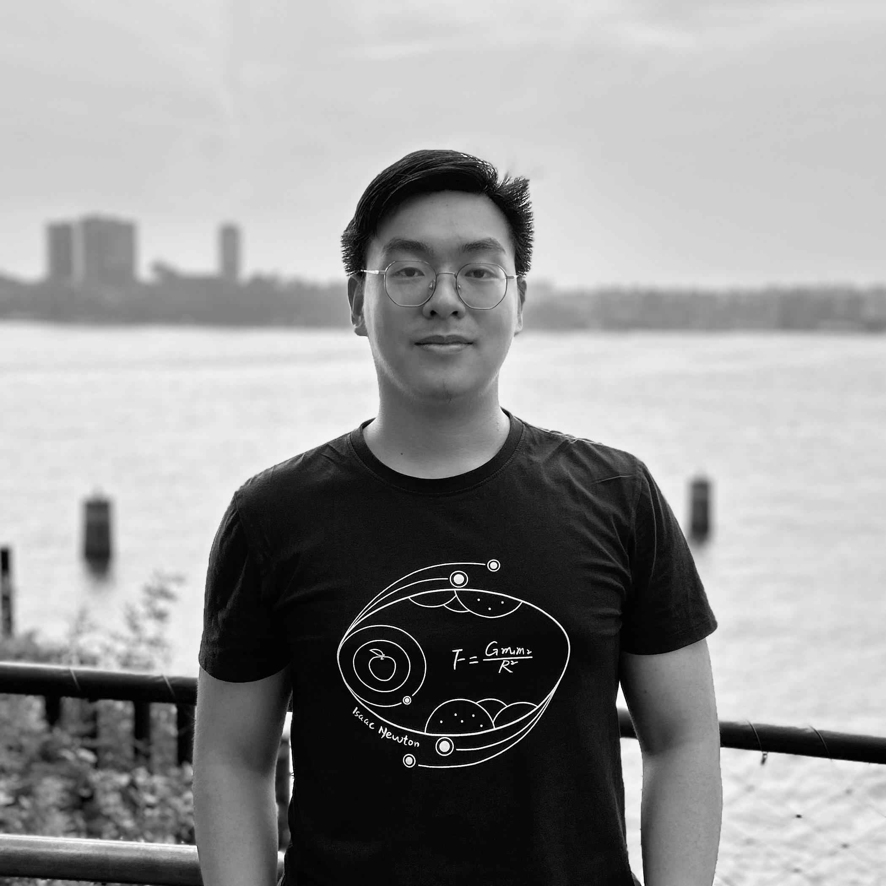
        <figcaption>Original (grayscale)</figcaption>
      </figure>
      <figure>
        
        <figcaption>After 9&times;9 box filter (fine details blurred)</figcaption>
      </figure>
    

    <h4>Finite difference operators Dx, Dy</h4>
    

      The finite difference kernels approximate horizontal (Dx) and vertical (Dy) derivatives and therefore highlight
      intensity changes (edges). The Dx response emphasizes vertical edges (it measures horizontal changes), while
      Dy emphasizes horizontal edges.
    

    

      <figure>
        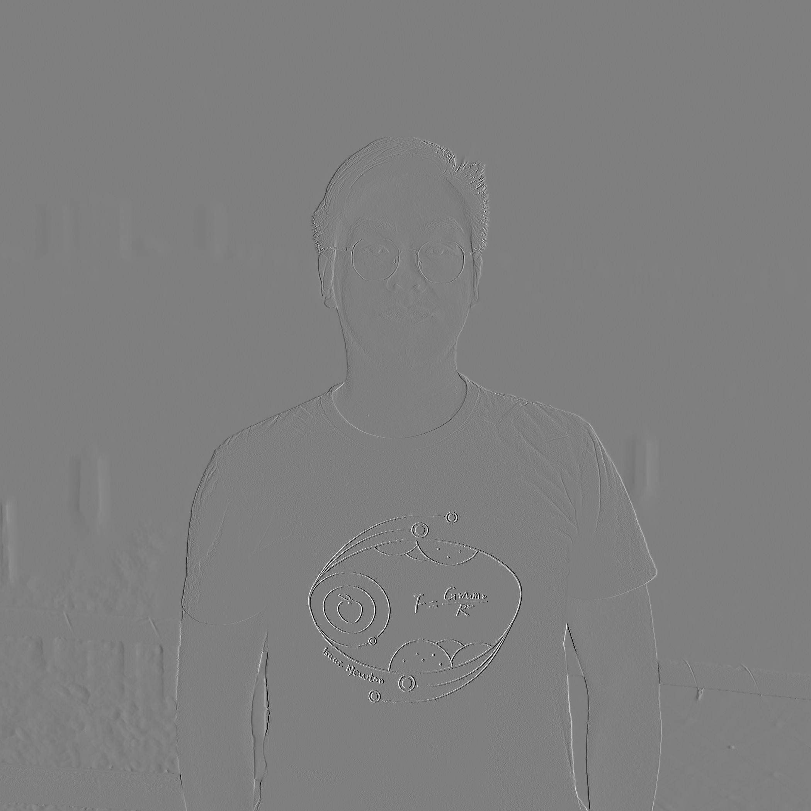
        <figcaption>Horizontal derivative (Dx)&nbsp;&mdash; shows vertical edges</figcaption>
      </figure>
      <figure>
        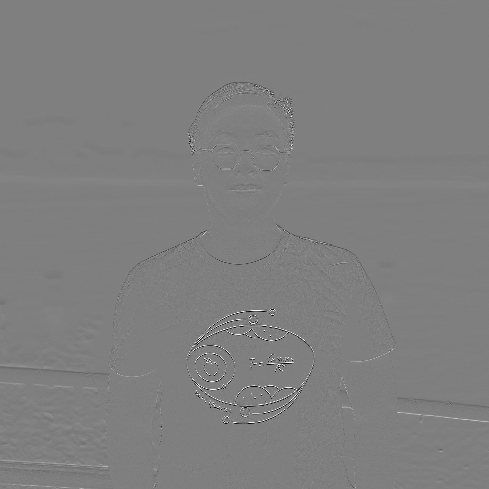
        <figcaption>Vertical derivative (Dy)&nbsp;&mdash; shows horizontal edges</figcaption>
      </figure>
    

    

      Padding is zero-fill to match the assignment and <code>convolve2d(..., boundary='fill', fillvalue=0)</code>.
      Values are processed in float and clipped only when saving for display.
    

  </section>

  <section id="part1-2">
    <h3 id="part1-2">1.2 Finite Difference Operator</h3>
    

      To detect edges, I applied the simplest finite-difference kernels: <code>[-1, 1]</code> for the horizontal direction
      and its transpose for the vertical direction. Convolving the Cameraman image with these filters measures
      horizontal and vertical intensity changes. The resulting derivative images highlight edges aligned with each axis.
    

    

      <article class="card"><figure>
        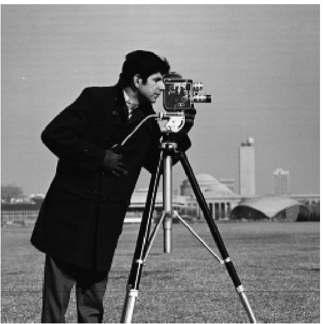
        <figcaption>Original Cameraman image.</figcaption>
      </figure></article>
      <article class="card"><figure>
        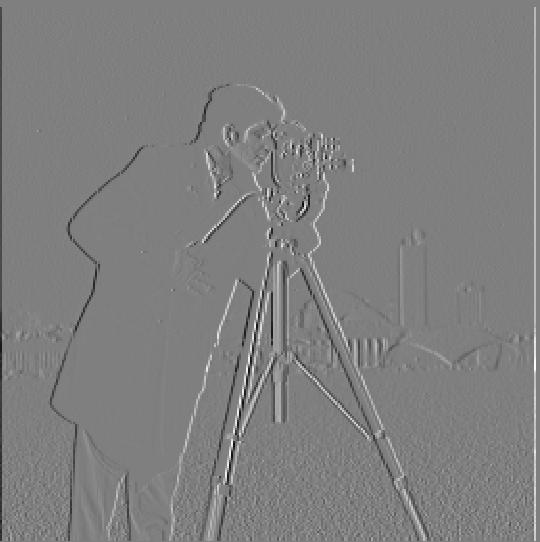
        <figcaption>Horizontal derivative (Dx).</figcaption>
      </figure></article>
      <article class="card"><figure>
        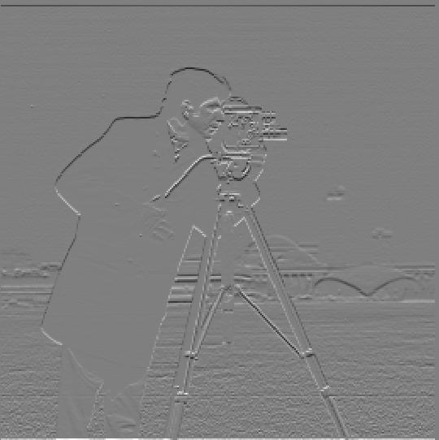
        <figcaption>Vertical derivative (Dy).</figcaption>
      </figure></article>
    

    

      Combining the two responses yields the gradient magnitude, which shows overall edge strength in the image.
      However, direct differencing is highly sensitive to high-frequency noise. In my experiment, faint texture
      and sensor noise were also emphasized along with boundaries.
    

    

      To focus on the most significant features, I thresholded the gradient magnitude at about <code>0.25</code>.
      This produces a cleaner binary edge map, where the outline of the cameraman and key scene structures are visible
      without much noises.
    

    

      <article class="card"><figure>
        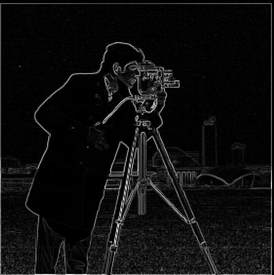
        <figcaption>Gradient magnitude — edges with amplified noise.</figcaption>
      </figure></article>
      <article class="card"><figure>
        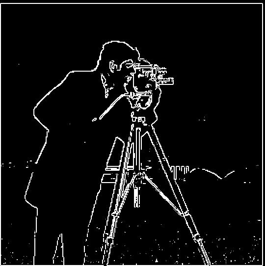
        <figcaption>Binary edge map (threshold ≈ 0.25).</figcaption>
      </figure></article>
    

  </section>

  <section id="part1-3">
    <h3 id="part1-3">1.3 Derivative of Gaussian (DoG) Filter</h3>
    

      Direct finite differences highlight edges but also amplify high-frequency noise. A common fix is to smooth
      the image <em>before</em> differentiating. Instead of running two separate passes (Gaussian blur then
      difference), we can convolve the finite-difference kernels with a Gaussian (&#963; = 1.0) to form
      <strong>Derivative-of-Gaussian (DoG)</strong> filters that both smooth and differentiate in one step.
    

    

      <article class="card"><figure>
        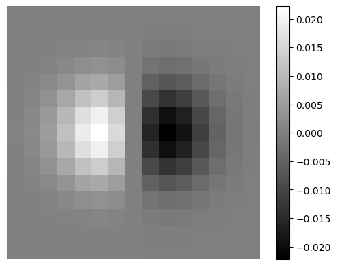
        <figcaption>DoG kernel: <em>d/dx</em> of a Gaussian (&#963; = 1.0).</figcaption>
      </figure></article>
      <article class="card"><figure>
        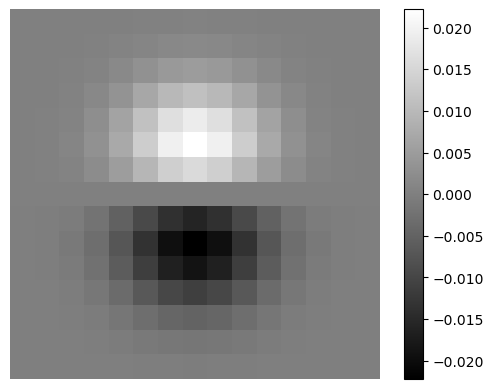
        <figcaption>DoG kernel: <em>d/dy</em> of a Gaussian (&#963; = 1.0).</figcaption>
      </figure></article>
    

    

      Compared to the raw gradient magnitude from Part&nbsp;1.2 (even after thresholding), DoG produces cleaner,
      more continuous edges. Although simple thresholding on the raw gradients is
      surprisingly strong, some background speckle still remains. DoG suppresses much of that residual noise and
      yields a smoother binary edge map.
    

    

      <article class="card"><figure>
        
        <figcaption>Finite-difference edges after thresholding — strong outlines but still noisy.</figcaption>
      </figure></article>
      <article class="card"><figure>
        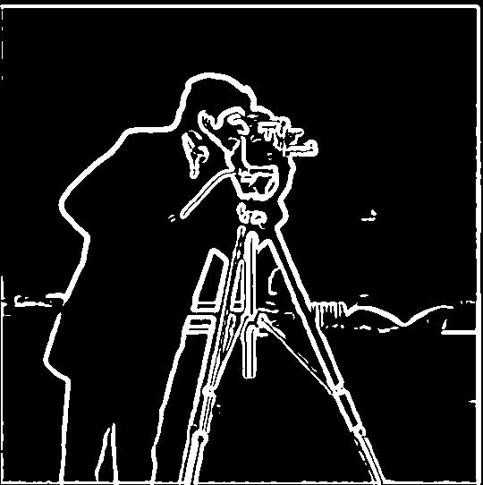
        <figcaption>DoG + thresholding — cleaner boundaries and reduced background speckle.</figcaption>
      </figure></article>
    

  </section>
</section>

<section id="part2">
  <h2 id="part2">Part 2 — Fun with Frequencies</h2>

  <section id="part2-1">
    <h3 id="part2-1">2.1 Image Sharpening</h3>
    

      I implement sharpening with <em>unsharp masking</em>: blur the image with a Gaussian, subtract to obtain the
      high-frequency layer, then add a scaled version of that layer back to the original. This boosts edges and textures:
    

    

      <code>low = gauss(I, &sigma;)</code>, <code>high = I - low</code>, <code>Isharp = I + &alpha;&middot;high</code>
    

    <!-- TAJ — full process -->
    <h4 id="sharpen-taj">Taj Mahal</h4>
    
Blur with &sigma; = 2.0. Two strengths shown: &alpha; = 3.0 and &alpha; = 6.0.

    

      <article class="card"><figure>
        
        <figcaption>Original.</figcaption>
      </figure></article>
      <article class="card"><figure>
        
        <figcaption>Gaussian blur (&sigma; = 2.0).</figcaption>
      </figure></article>
      <article class="card"><figure>
        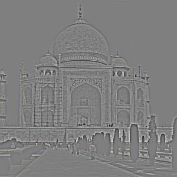
        <figcaption>High-frequency layer.</figcaption>
      </figure></article>
    

    

      <article class="card"><figure>
        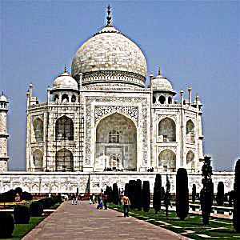
        <figcaption>Sharpened (&alpha; = 3.0) &mdash; crisper details.</figcaption>
      </figure></article>
      <article class="card"><figure>
        
        <figcaption>Sharpened (&alpha; = 6.0) &mdash; very sharp details.</figcaption>
      </figure></article>
    

    <!-- VIEW — show high layer and two strengths -->
    <h4 id="sharpen-view">Skógafoss waterfall</h4>
    
Same procedure with &sigma; = 2.0. Compare &alpha; = 1.0 vs. &alpha; = 3.0.

    

      <article class="card"><figure>
        
        <figcaption>Original.</figcaption>
      </figure></article>
      <article class="card"><figure>
        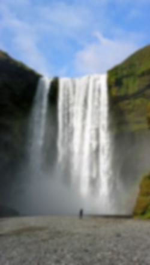
        <figcaption>Blurred baseline (&sigma; = 2.0).</figcaption>
      </figure></article>
      <article class="card"><figure>
        
        <figcaption>High-frequency layer.</figcaption>
      </figure></article>
    

    

      <article class="card"><figure>
        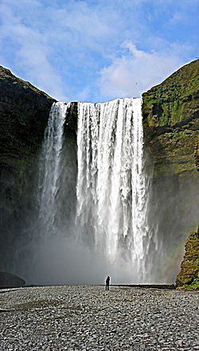
        <figcaption>Sharpened (&alpha; = 1.0) &mdash; natural.</figcaption>
      </figure></article>
      <article class="card"><figure>
        
        <figcaption>Sharpened (&alpha; = 3.0) &mdash; the details are excessively sharpened.</figcaption>
      </figure></article>
    

    <!-- TREE — before/after with note about leaves -->
    <h4 id="sharpen-tree">Pine Tree &mdash; effect on fine foliage</h4>
    

      Here I focus on the visual trade-off. Sharpening strengthens the main branches and trunk edges, but some fine
      needles are partially lost (the Gaussian blur removes it before amplification). This is a typical outcome:
      clear structural contrast improves, while sub-pixel foliage detail does not fully return.
    

    

      <article class="card"><figure>
        
        <figcaption>Original.</figcaption>
      </figure></article>
      <article class="card"><figure>
        
        <figcaption>Blurred baseline (&sigma; = 1.0).</figcaption>
      </figure></article>
      <article class="card"><figure>
        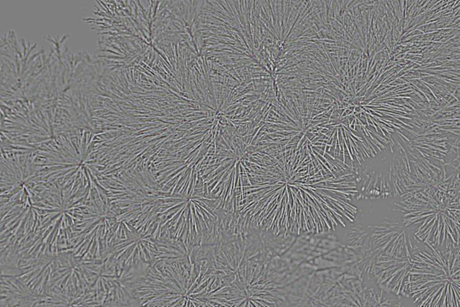
        <figcaption>High-frequency layer.</figcaption>
      </figure></article>
    

    

      <article class="card"><figure>
        
        <figcaption>Original.</figcaption>
      </figure></article>
      <article class="card"><figure>
        
        <figcaption>Sharpened (&alpha; = 6.0) &mdash; stronger branches, some fine leaves suppressed.</figcaption>
      </figure></article>
    

    

      Parameter notes: I used &sigma; between 1&ndash;2 and varied &alpha; between 1&ndash;6. Larger &alpha; increases
      apparent sharpness but can introduce halos/noise; moderate values (&alpha; = 1&ndash;3) look most natural.
    

  </section>

<section id="part2-2">
  <h3>2.2 Hybrid Images</h3>
  

    Hybrid images combine the <em>low frequencies</em> of one picture with the <em>high frequencies</em> of another.
    Up close, the viewer perceives the high-frequency image; from far away, the low-frequency image dominates. This effect
    illustrates how our visual system interprets spatial frequency content.
  

  <!-- Derek + Nutmeg -->
  <h4>Derek + Nutmeg (assignment example)</h4>
  

    This is the canonical example provided by the assignment. Derek contributes low-frequency structure, while Nutmeg
    provides high-frequency detail. The result shifts perception depending on viewing distance, validating the hybrid
    image concept.
  

  

    <figure>
      
      <figcaption>Derek Original (aligned)</figcaption>
    </figure>
    <figure>
      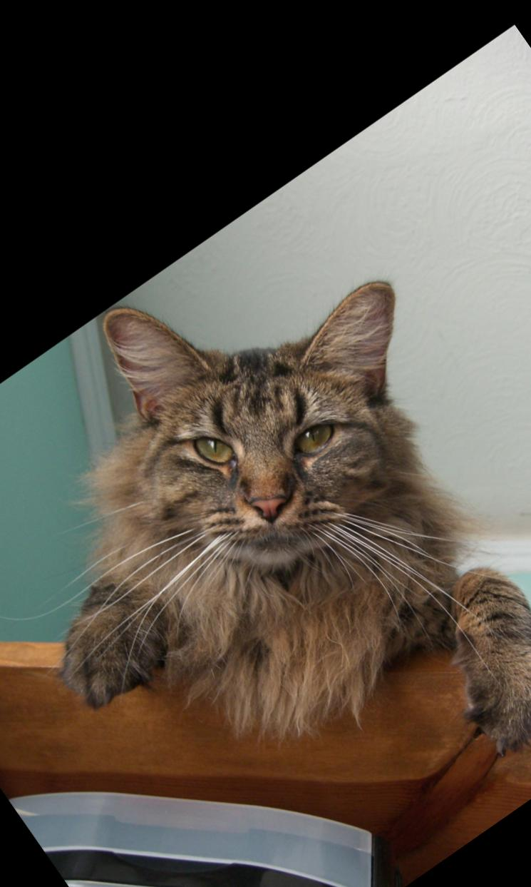
      <figcaption>Nutmeg Original (aligned)</figcaption>
    </figure>
  

  

    <figure>
      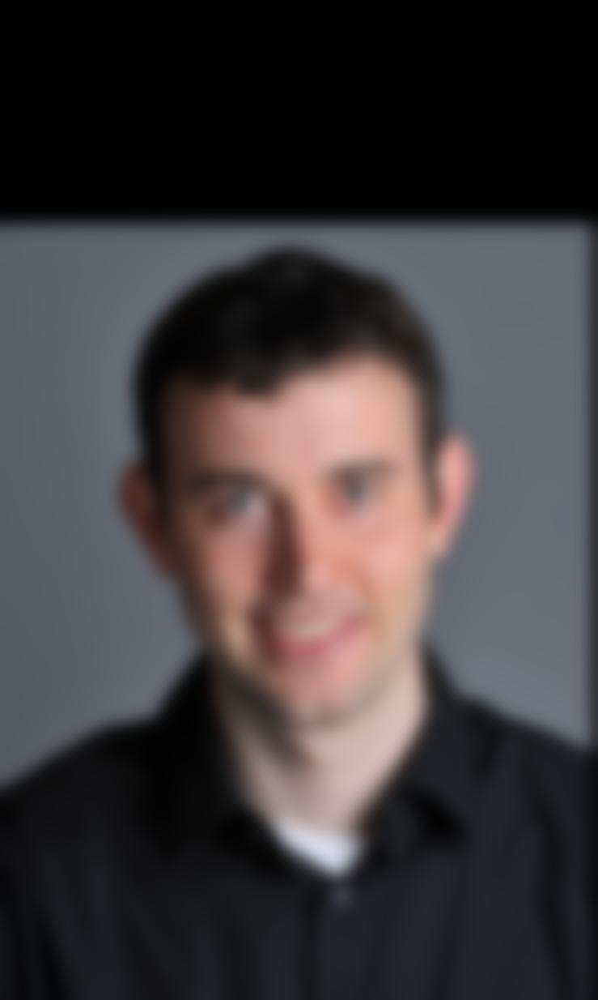
      <figcaption>Derek (low-pass)</figcaption>
    </figure>
    <figure>
      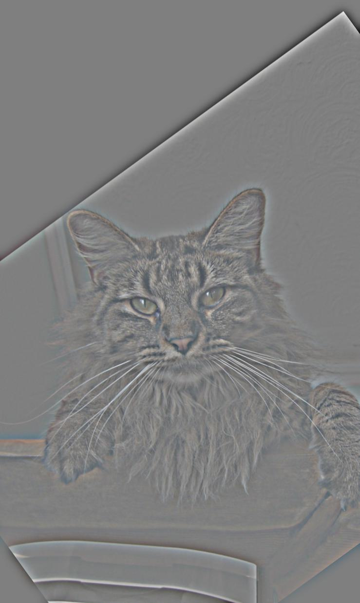
      <figcaption>Nutmeg (high-pass)</figcaption>
    </figure>
  

  <figure>
    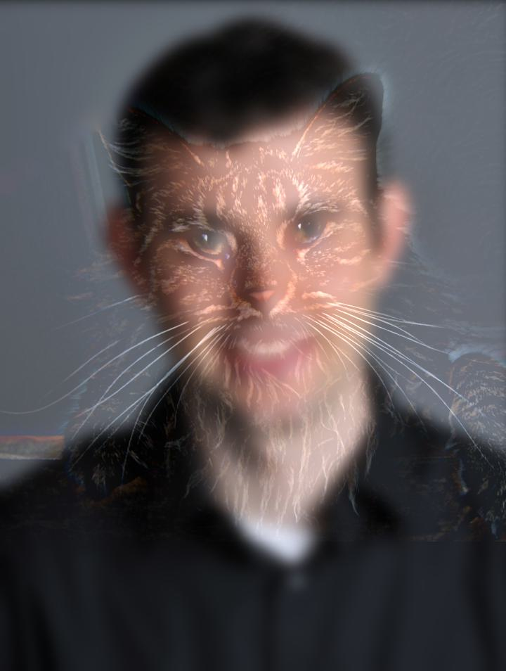
    <figcaption>Hybrid image: Nutmeg up close, Derek from a distance.</figcaption>
  </figure>

  <!-- Sauber + Tractor -->
  <h4>Sauber C44 + Tractor (the “Green Tractor” meme)</h4>
  

    As a Formula&nbsp;1 fan, I chose this hybrid to represent the 2024 Sauber C44. The car was notoriously slow, scoring
    only once all season (thanks to ZHOU Guanyu). Fans joked it was more like a <q>green tractor</q> than a Formula&nbsp;1 car.
    Here the C44 provides low-frequency structure, while a green tractor contributes high-frequency details. This produces
    a image that visually supports the meme.
  

  

    <figure>
      
      <figcaption>Sauber C44 Original (aligned)</figcaption>
    </figure>
    <figure>
      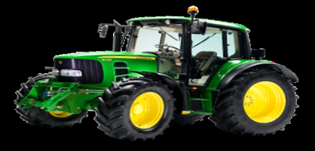
      <figcaption>Green Tractor Original (aligned)</figcaption>
    </figure>
  

  

    <figure>
      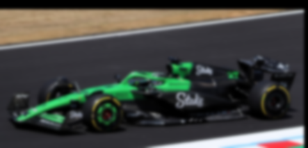
      <figcaption>Sauber C44 (low-pass)</figcaption>
    </figure>
    <figure>
      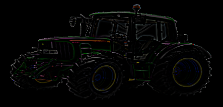
      <figcaption> Green Tractor (high-pass)</figcaption>
    </figure>
  

  <figure>
    
    <figcaption>Hybrid image: C44 body with tractor detail.</figcaption>
  </figure>
  

    To illustrate the effect in the frequency domain, I also plot the FFT magnitudes. The low-pass Sauber spectrum shows
    concentration at the center (low frequencies), while the high-pass tractor spectrum spreads into the periphery. The
    hybrid FFT combines these, confirming how Gaussian filtering redistributes energy across frequency bands.
  

  

    <figure>
      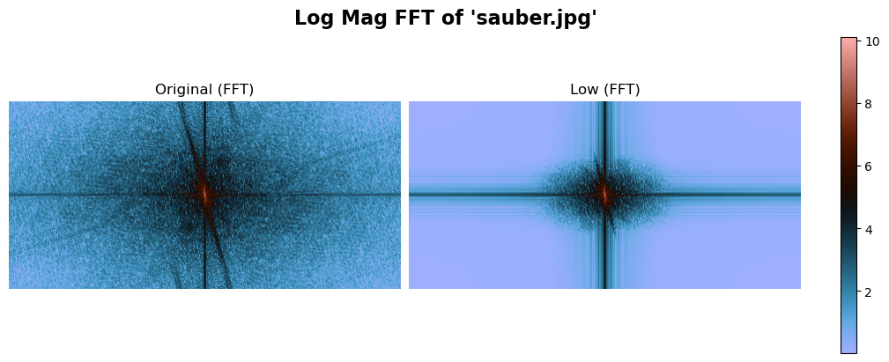
      <figcaption>FFT of Sauber (low frequencies dominate center)</figcaption>
    </figure>
    <figure>
      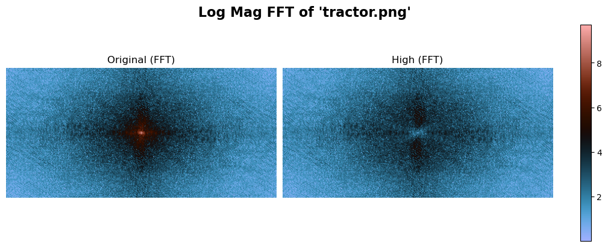
      <figcaption>FFT of Tractor (high frequencies dominate edges)</figcaption>
    </figure>
    <figure>
      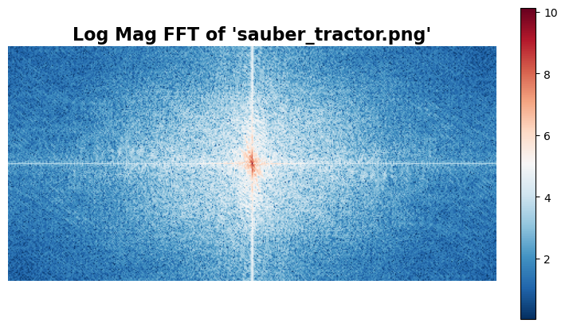
      <figcaption>FFT of Hybrid (mixture of both)</figcaption>
    </figure>
  

  <!-- Binotto + Clown -->
  <h4>Binotto + Clown (Ferrari strategy meme)</h4>
  

    Mattia Binotto, Ferrari’s former team principal, became infamous for poor race strategies that undermined great cars
    and drivers. Fans called him the <q>principal clown</q> of Formula&nbsp;1. After leaving Ferrari, he later joined Sauber,
    making the hybrid with a clown face an apt metaphor. Here Binotto’s portrait is low-pass, while a clown overlay provides
    the high-frequency features.
  

  

    <figure>
      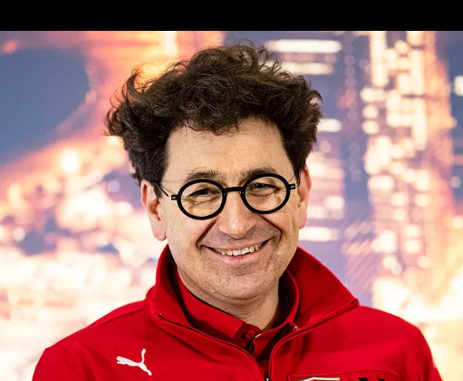
      <figcaption>Binotto Original (aligned)</figcaption>
    </figure>
    <figure>
      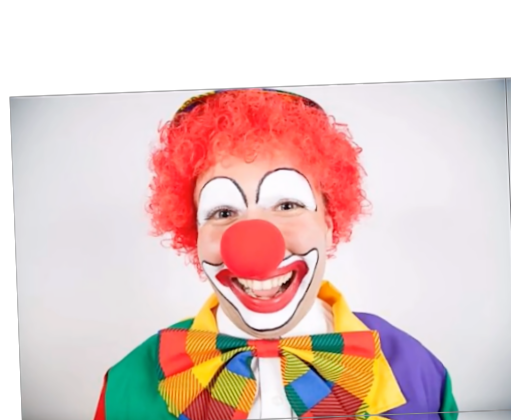
      <figcaption>Clown  Original (aligned)</figcaption>
    </figure>
  

  

    <figure>
      
      <figcaption>Binotto (low-pass)</figcaption>
    </figure>
    <figure>
      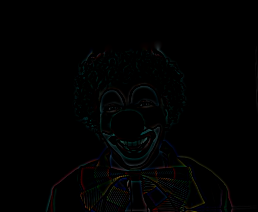
      <figcaption>Clown (high-pass)</figcaption>
    </figure>
  

  <figure>
    
    <figcaption>Hybrid image: Binotto up close, clown from a distance.</figcaption>
  </figure>
</section>

<section id="part2-3">
  <h3 id="part2-3">2.3 Gaussian &amp; Laplacian Stacks</h3>
  

    I build a Gaussian stack by repeatedly low-pass filtering the image (no downsampling) and a Laplacian stack by
    subtracting adjacent Gaussian levels (<code>Lk = Gk − Gk+1</code>, with the coarsest
    <code>G</code> kept as the last level). For blending, a <em>feathered mask</em> is filtered into its own Gaussian stack,
    and at each level I interpolate between the two Laplacian bands with the corresponding mask level, then sum all bands
    back to reconstruct.
  

  

    Below: selected stack levels for the classic Apple–Orange example. Each row shows the same level for
    <strong>Apple</strong>, <strong>Orange</strong>, and the <strong>per-level blend</strong>.
    I include levels 0, 1, 4, and 8 to illustrate fine &rarr; coarse structure.
  

  <!-- Inputs -->
  

    <figure>
      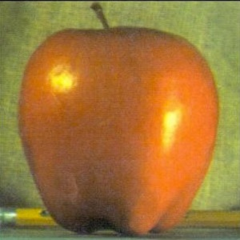
      <figcaption>Source A — Apple.</figcaption>
    </figure>
    <figure>
      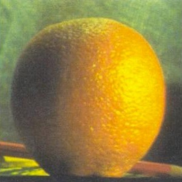
      <figcaption>Source B — Orange.</figcaption>
    </figure>
  

  <!-- Level 0 -->
  <h4 class="muted">Level 0</h4>
  

    <figure>
      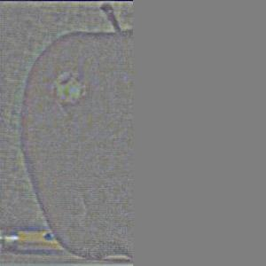
      <figcaption>Apple — Level&nbsp;0</figcaption>
    </figure>
    <figure>
      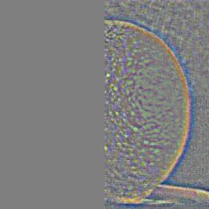
      <figcaption>Orange — Level&nbsp;0</figcaption>
    </figure>
    <figure>
      
      <figcaption>Blend — Level&nbsp;0</figcaption>
    </figure>
  

  <!-- Level 1 -->
  <h4 class="muted">Level 1</h4>
  

    <figure>
      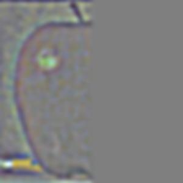
      <figcaption>Apple — Level&nbsp;1</figcaption>
    </figure>
    <figure>
      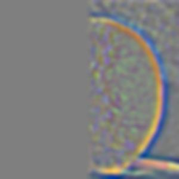
      <figcaption>Orange — Level&nbsp;1</figcaption>
    </figure>
    <figure>
      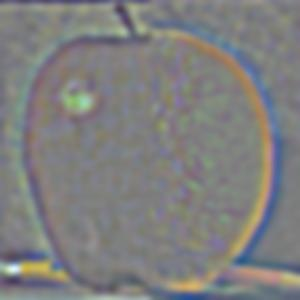
      <figcaption>Blend — Level&nbsp;1</figcaption>
    </figure>
  

  <!-- Level 4 -->
  <h4 class="muted">Level 4</h4>
  

    <figure>
      
      <figcaption>Apple — Level&nbsp;4</figcaption>
    </figure>
    <figure>
      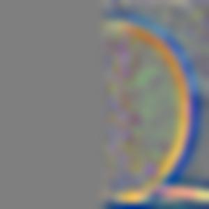
      <figcaption>Orange — Level&nbsp;4</figcaption>
    </figure>
    <figure>
      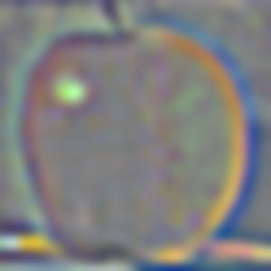
      <figcaption>Blend — Level&nbsp;4</figcaption>
    </figure>
  

  <!-- Level 8 -->
  <h4 class="muted">Level 8 (coarsest)</h4>
  

    <figure>
      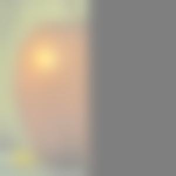
      <figcaption>Apple — Level&nbsp;8</figcaption>
    </figure>
    <figure>
      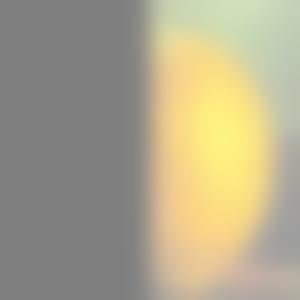
      <figcaption>Orange — Level&nbsp;8</figcaption>
    </figure>
    <figure>
      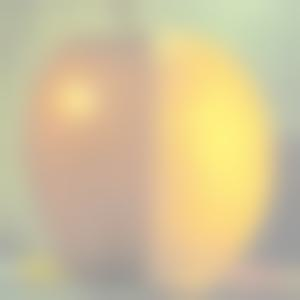
      <figcaption>Blend — Level&nbsp;8</figcaption>
    </figure>
  

  <!-- Final -->
  

    <figure>
      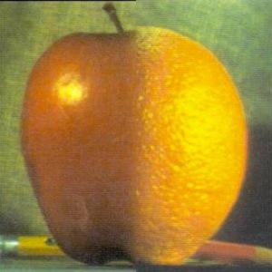
      <figcaption>Final reconstruction from per-level blends.</figcaption>
    </figure>
    <figure>
      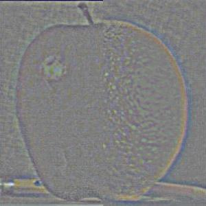
      <figcaption>Mask (level&nbsp;0) used to guide blending across scales.</figcaption>
    </figure>
  

  

    Reading the rows left&rarr;right: fine-scale bands (levels 0–1) carry sharp texture;
    mid-scales (e.g., level&nbsp;4) carry contours; the coarsest level (8) preserves overall brightness/lighting.
    Blending each band with a <em>Gaussian-smoothed mask</em> avoids hard seams and produces the smooth apple-to-orange transition.
  

</section>

<section id="part2-4">
  <h3 id="part2-4">2.4 Multiresolution Blending</h3>
  <!-- Foothill -->
  <h4 id="blend-foothill">Foothill — blue sky ↔ cloudy sky</h4>
  

    I often shoot the same view from my dorm. To compare the weathers, I blended a blue-sky frame (left)
    with a cloudy frame (right). The Gaussian masks ensure the transition is smooth.
  

  <!-- Inputs -->
  

    <figure>
      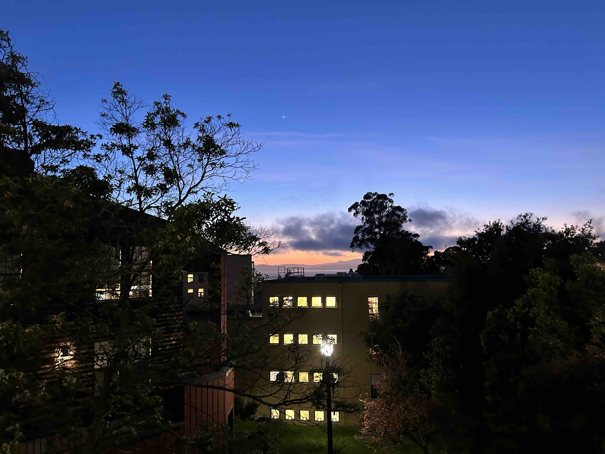
      <figcaption>Left (blue sky).</figcaption>
    </figure>
    <figure>
      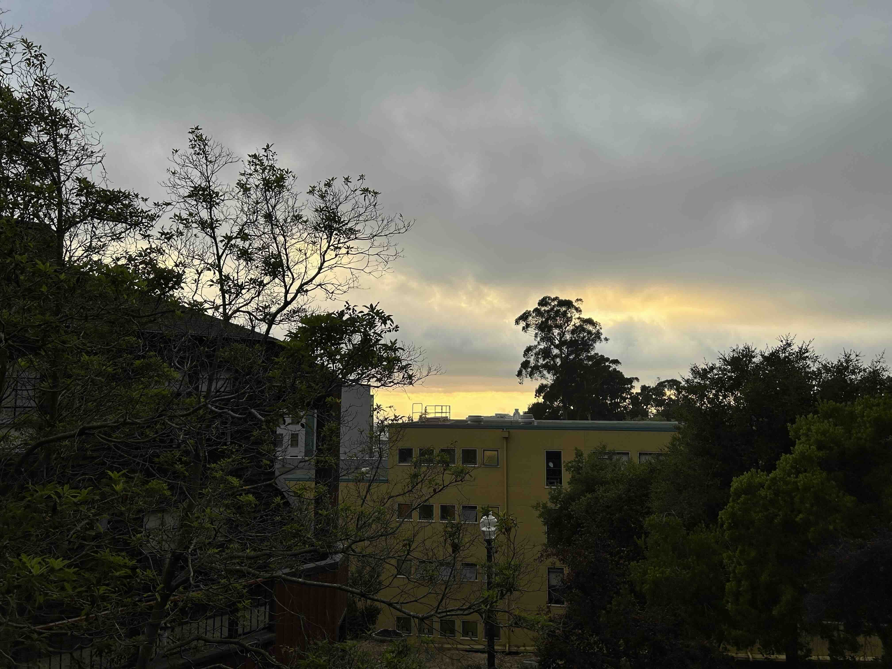
      <figcaption>Right (cloudy).</figcaption>
    </figure>
  

  <!-- Selected levels: 0,1,4,8 -->
  <h5 class="muted">Selected stack levels (Left, Right, Mask)</h5>

  <h6 class="muted">Level 0</h6>
  

    <figure>
      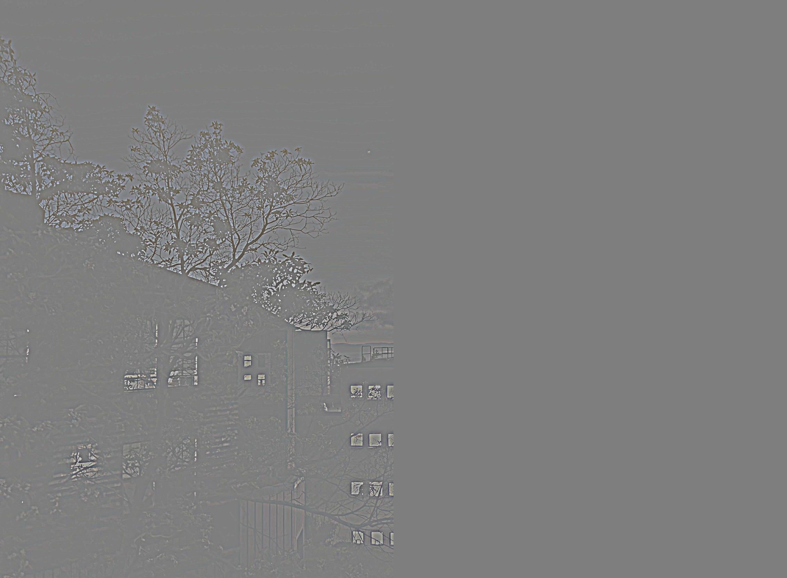
      <figcaption>Left — Level&nbsp;0</figcaption>
    </figure>
    <figure>
      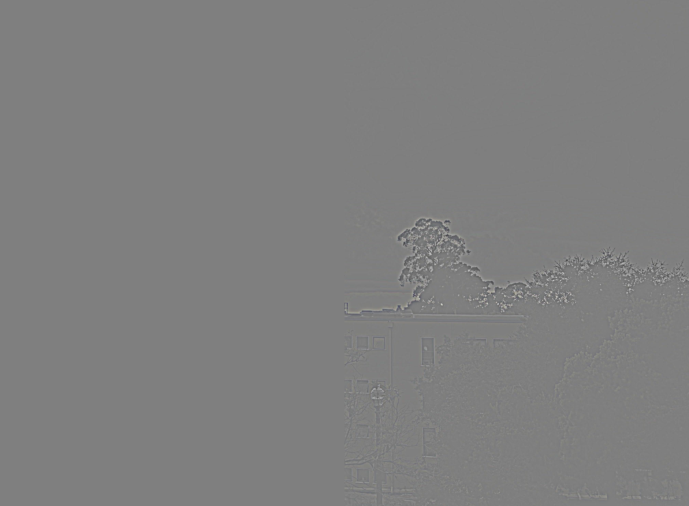
      <figcaption>Right — Level&nbsp;0</figcaption>
    </figure>
    <figure>
      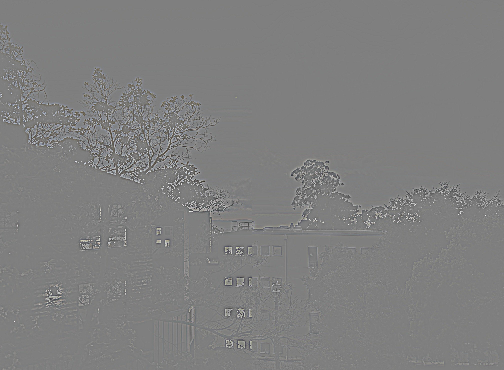
      <figcaption>Blend — Level&nbsp;0</figcaption>
    </figure>
  

  <h6 class="muted">Level 1</h6>
  

    <figure>
      
      <figcaption>Left — Level&nbsp;1</figcaption>
    </figure>
    <figure>
      
      <figcaption>Right — Level&nbsp;1</figcaption>
    </figure>
    <figure>
      
      <figcaption>Blend — Level&nbsp;1</figcaption>
    </figure>
  

  <h6 class="muted">Level 4</h6>
  

    <figure>
      
      <figcaption>Left — Level&nbsp;4</figcaption>
    </figure>
    <figure>
      
      <figcaption>Right — Level&nbsp;4</figcaption>
    </figure>
    <figure>
      
      <figcaption>Blend — Level&nbsp;4</figcaption>
    </figure>
  

  <h6 class="muted">Level 8 (coarsest)</h6>
  

    <figure>
      
      <figcaption>Left — Level&nbsp;8</figcaption>
    </figure>
    <figure>
      
      <figcaption>Right — Level&nbsp;8</figcaption>
    </figure>
    <figure>
      
      <figcaption>Blend — Level&nbsp;8</figcaption>
    </figure>
  

  <!-- Final blend -->
  <figure>
    
    <figcaption>Final blend — smooth transition</figcaption>
  </figure>

  

  <!-- Hand + Earth -->
  <h4 id="blend-hand">Hand &amp; Earth</h4>
  

    Inspired by the thought experiment that humans might be created or controlled by external agents, I blended a hand
    with the Earth. A <em>radial-ish</em> mask centered on the planet allows the smooth blending between hand and Earth.
  

  <!-- Inputs -->
  

    <figure>
      
      <figcaption>Hand</figcaption>
    </figure>
    <figure>
      
      <figcaption>Earth</figcaption>
    </figure>
  

  <!-- Selected levels: 0,1,4,8 -->
  <h5 class="muted">Selected stack levels (Hand, Earth, Blend)</h5>

  <h6 class="muted">Level 0</h6>
  

    <figure>
      
      <figcaption>Hand — Level&nbsp;0</figcaption>
    </figure>
    <figure>
      
      <figcaption>Earth — Level&nbsp;0</figcaption>
    </figure>
    <figure>
      
      <figcaption>Blend — Level&nbsp;0</figcaption>
    </figure>
  

  <h6 class="muted">Level 1</h6>
  

    <figure>
      
      <figcaption>Hand — Level&nbsp;1</figcaption>
    </figure>
    <figure>
      
      <figcaption>Earth — Level&nbsp;1</figcaption>
    </figure>
    <figure>
      
      <figcaption>Blend — Level&nbsp;1</figcaption>
    </figure>
  

  <h6 class="muted">Level 4</h6>
  

    <figure>
      
      <figcaption>Hand — Level&nbsp;4</figcaption>
    </figure>
    <figure>
      
      <figcaption>Earth — Level&nbsp;4</figcaption>
    </figure>
    <figure>
      
      <figcaption>Blend — Level&nbsp;4</figcaption>
    </figure>
  

  <h6 class="muted">Level 8</h6>
  

    <figure>
      
      <figcaption>Hand — Level&nbsp;8</figcaption>
    </figure>
    <figure>
      
      <figcaption>Earth — Level&nbsp;8</figcaption>
    </figure>
    <figure>
      
      <figcaption>Blend — Level&nbsp;8</figcaption>
    </figure>
  

  <!-- Final blend -->
  

    <figure>
      
      <figcaption>Final blend.</figcaption>
    </figure>
    <figure>
      
      <figcaption>Mask.</figcaption>
    </figure>
  

</section>

<section id="reflection">
  <h2 id="reflection">Discussion &amp; Reflection</h2>
  

  This project gave me hands-on experience with how frequency analysis underlies many classic image-processing techniques. From implementing convolutions and edge detection to sharpening and multiresolution blending, I saw how simple filters can reveal structure, suppress noise, or seamlessly merge images. Each part built on the previous one, deepening my understanding of how images can be decomposed into frequency components and recombined in useful ways.
  

  

  The most exciting part for me was creating hybrid images. As a Formula 1 fan, I especially enjoyed blending the slow Sauber C44 with a tractor—a visual joke that also perfectly illustrates low- vs. high-frequency decomposition. Seeing how the hybrid image changes depending on viewing distance, and confirming it through FFT plots, connected the math directly to perception in a way that was both rigorous and fun.
  

</section>

<section id="assets">
  <h2 id="assets">Assets &amp; Downloads</h2>
  <ul>
    <li><a href="./assets/">Full-resolution figures and intermediate levels</a></li>
  </ul>
</section>
