<section id="overview">
    <h2 id="overview">Overview</h2>
    

    This project is an exploration into Neural Radiance Fields (NeRF), a cutting-edge technique for synthesizing novel 3D views from a 2D image collection. The core idea is to train a simple neural network to represent an entire 3D scene as a continuous 5D function that maps a 3D coordinate `(x,y,z)` and 2D viewing direction `(θ,φ)` to a color `(r,g,b)` and density `(σ)`.
    

    

    To achieve this, the project is broken into several key parts. First, I performed a full camera calibration and pose estimation pipeline to capture my own 3D object (a small succulent) and generate the necessary training data. Second, I implemented a 2D "neural field" as a warm-up to understand how positional encoding allows an MLP to overfit to an image. Finally, I built the full NeRF model, trained it on both a provided dataset and my own, and rendered novel view orbits.
    

</section>

<section id="part0">
    <h2 id="part0">Part 0: Camera Calibration and 3D Scanning</h2>
    

        The goal of Part 0 is to create a complete training dataset for a NeRF, which requires two things for every image: the image itself, and the *exact* 3D camera pose (position and orientation) from which it was taken. This was a four-part process.
    

<section id="part0-1">
    <h3>Part 0.1: Camera Intrinsics</h3>
    

        First, I had to find my camera's "fingerprint," or <strong>intrinsics</strong>. This includes its focal length and lens distortion. To do this, I took around 50 photos of a printed ArUco grid from various angles and distances. By analyzing how the known grid pattern was distorted in these images, OpenCV's <code>cv2.calibrateCamera</code> function could solve for the camera's intrinsic matrix, <code>K</code>, and distortion coefficients, <code>dist_coeffs</code>.
    

    

        <figure>
        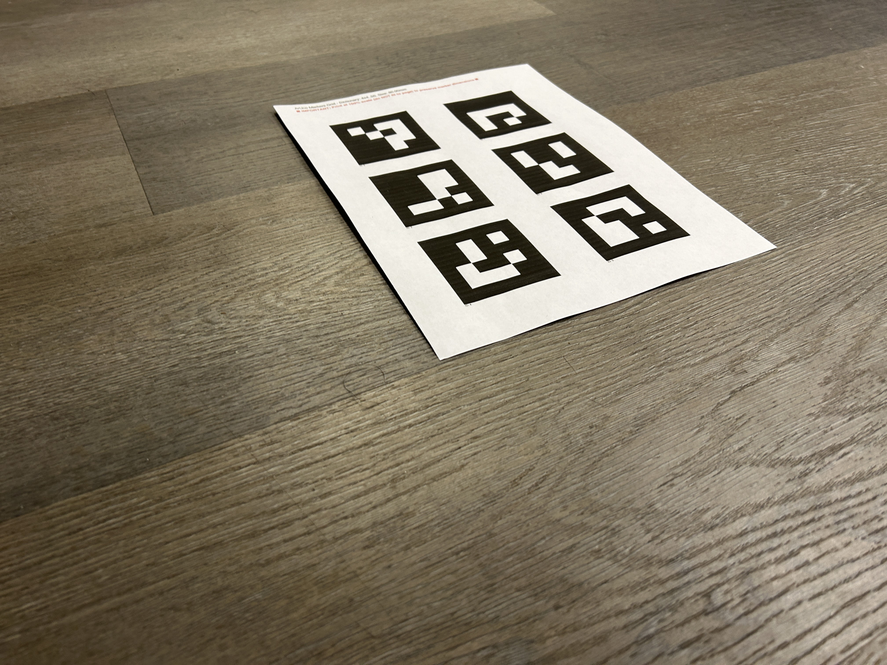
        <figcaption>One of the 50 calibration images of the ArUco grid.</figcaption>
        </figure>
        <figure>
        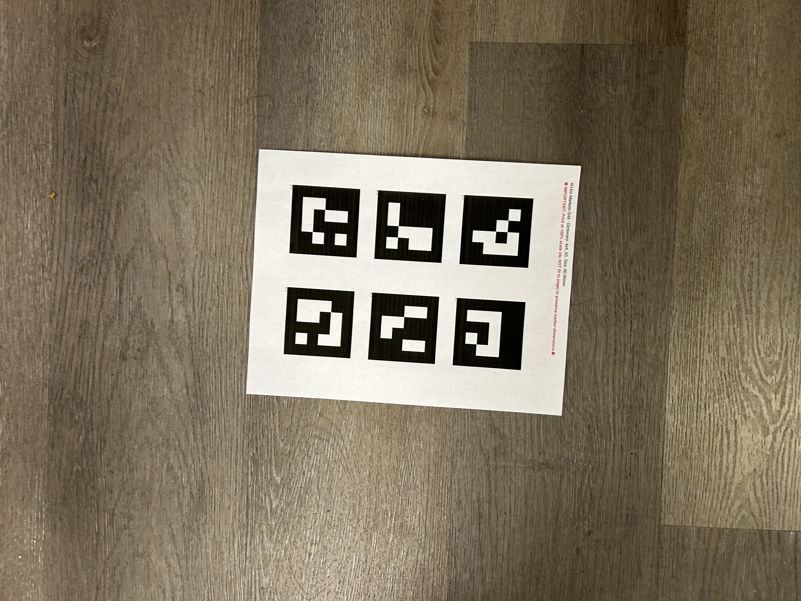
        <figcaption>Another calibration image, showing a different angle.</figcaption>
        </figure>
    

</section>

<section id="part0-2">
    <h3>Part 0.2: Capturing a 3D Object Scan</h3>
    

        With the camera calibrated, I took around 50 photos of my chosen object, a small plush succulent. I placed the object next to a <em>single</em> ArUco tag, which serves as the 3D world's origin (0,0,0). I was careful to keep the tag visible in every shot.
    

    <figure>
        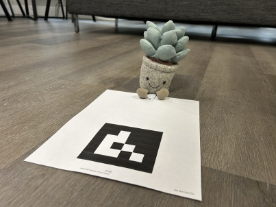
        <figcaption>My object, a plush succulent, with the single ArUco tag defining the scene's origin.</figcaption>
    </figure>
</section>

<section id="part0-3">
    <h3>Part 0.3: Estimating Camera Pose</h3>
    

        This step finds the <strong>extrinsics</strong> (the 3D pose) for every object photo. I looped through all 100 images and used <code>cv2.solvePnP</code>. This function uses the known intrinsics (from 0.1) and the 2D position of the single tag (from 0.2) to solve for the 3D camera-to-world (<code>c2w</code>) transformation matrix for that specific image.
    

    <h4>Camera Pose Visualization</h4>
    

        The result is a set of 3D poses for all my input cameras. The Viser visualizations below show all the calculated camera frustums (each representing one photo) oriented correctly around the world origin where the tag was placed. These are the two required screenshots for the deliverable.
    

    

        <figure>
        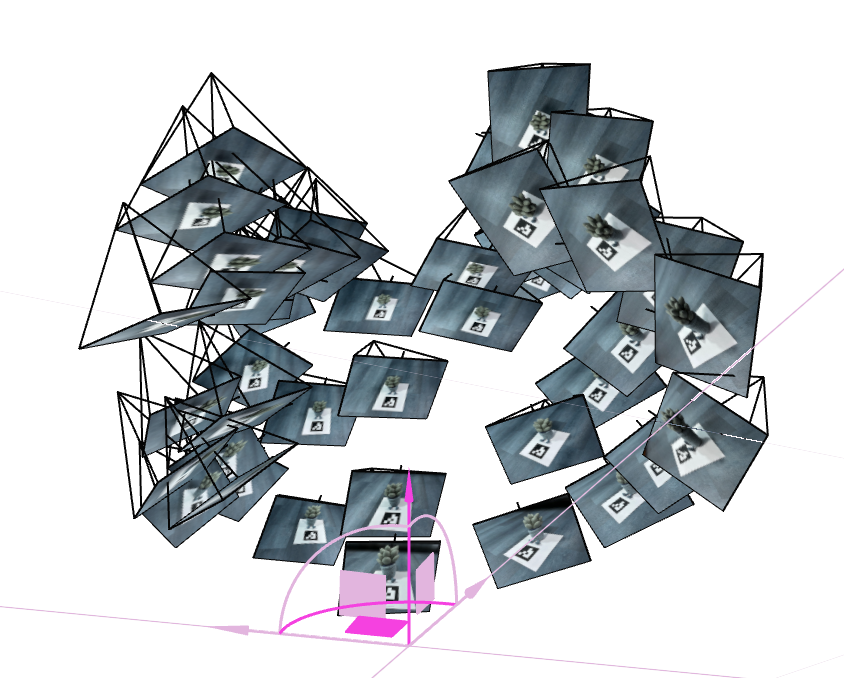
        <figcaption>A bottom-up view of the calculated camera poses in Viser.</figcaption>
        </figure>
        <figure>
        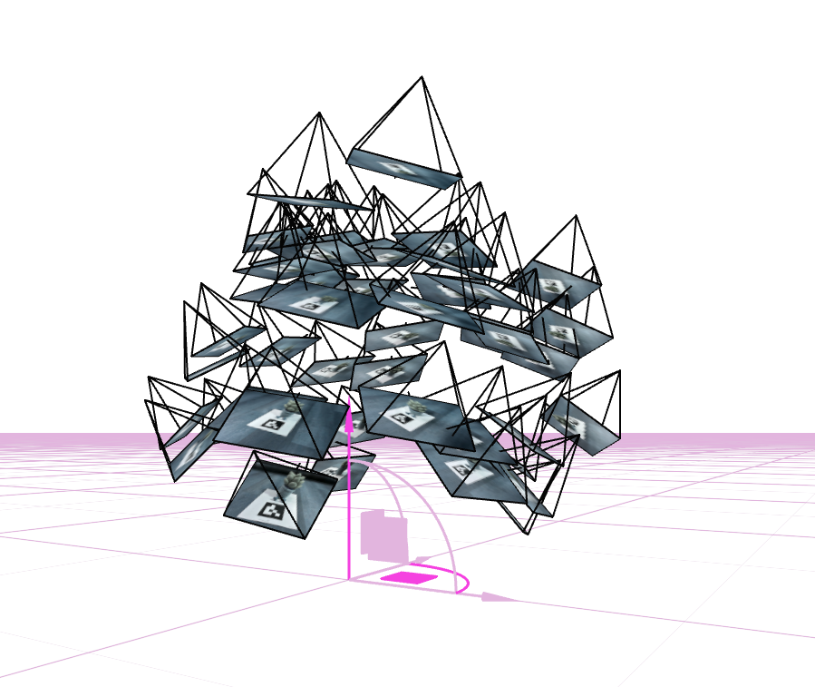
        <figcaption>A side view of the camera frustums, showing their distribution.</figcaption>
        </figure>
    

</section>

<section id="part0-4">
    <h3>Part 0.4: Dataset Creation</h3>
    

        Finally, I processed all this information into the final <code>my_data.npz</code> file. I used <code>cv2.undistort</code> to remove lens distortion from every image. Critically, after a long debugging process, I realized I must save the *entire, precise* camera matrix <code>K</code> and the final cropped image dimensions <code>H</code> and <code>W</code>, rather than just the focal length. This was the key to fixing a "stuck loss" bug in Part 2, as it ensures the ray generation step has 100% correct camera parameters.
    

</section>
</section>

<!-- 
    ==================================================================
    PART 1: 2D NEURAL FIELD
    ==================================================================
-->
<section id="part1">
    <h2 id="part1">Part 1: Fit a Neural Field to a 2D Image</h2>
    

    Before tackling a 5D function, Part 1 is a warm-up using a simpler 3D function: <code>f(u,v) -> (r,g,b)</code>. The goal is to train a simple MLP to overfit to a single image, effectively using the network's weights as a compressed representation of that image.
    

    

    A standard MLP would fail at this, as it's notoriously bad at learning high-frequency details. The key is <strong>Positional Encoding</strong>. By mapping the simple 2D <code>(u,v)</code> coordinates (normalized to [-1, 1]) to a high-dimensional feature vector using <code>sin</code> and <code>cos</code> functions, we allow the MLP to easily learn the fine textures in the fox's fur. My model used an 8-layer MLP (256 width) with a positional encoding level of <code>L=10</code>.
    

<!-- DELIVERABLE: Training process images -->
<h3>Training Process</h3>

The model was trained for 2000 iterations. The images below show its progress, starting from a uniform gray (the network's initial "average" guess) and quickly resolving into the high-frequency details of the fox.

    <figure>
    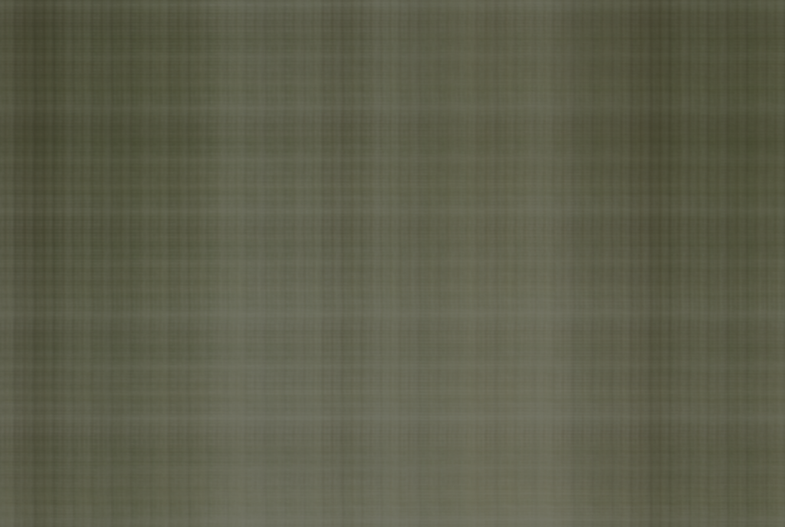
    <figcaption>Iteration 10</figcaption>
    </figure>
    <figure>
    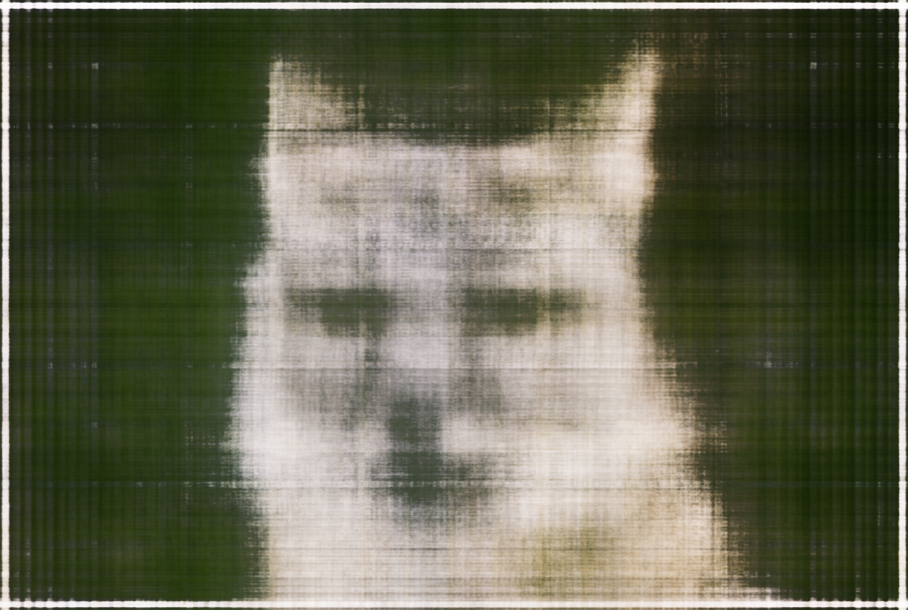
    <figcaption>Iteration 100</figcaption>
    </figure>
    <figure>
    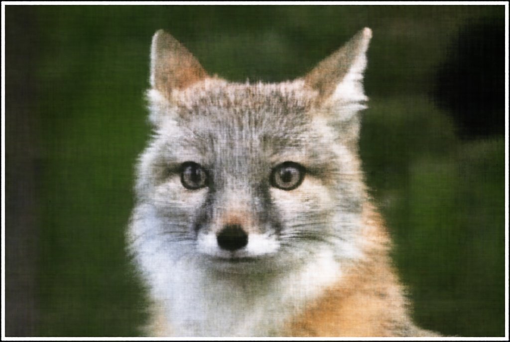
    <figcaption>Iteration 1000</figcaption>
    </figure>
    <figure>
    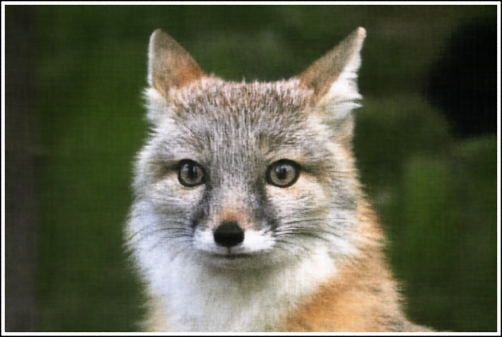
    <figcaption>Iteration 2000 (Final)</figcaption>
    </figure>
    <figure>
    
    <figcaption>Original Image</figcaption>
    </figure>

<!-- DELIVERABLE: PSNR Curve -->
<h3>PSNR Curve</h3>

The model's performance was tracked using the Peak Signal-to-Noise Ratio (PSNR). The graph below shows a rapid increase as the model learns the basic colors, followed by a slower, steady climb as it resolves the fine details.

<figure>
    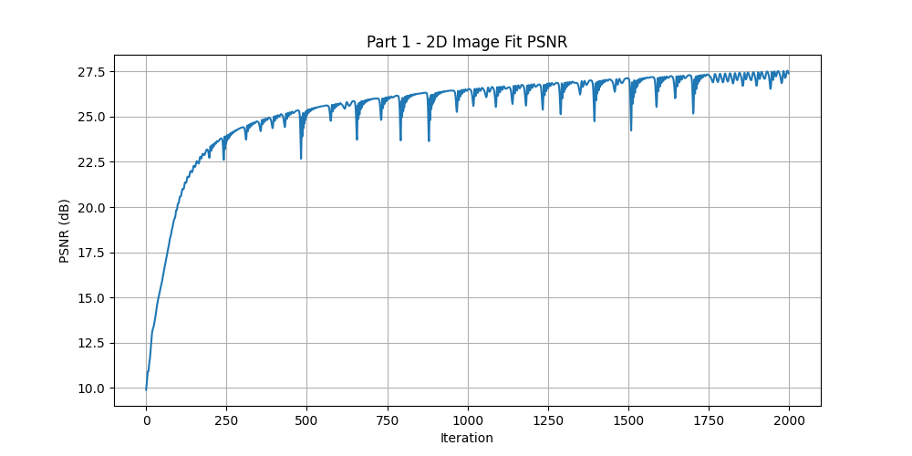
    <figcaption>PSNR (dB) vs. Training Iterations for the 2D image fit.</figcaption>
</figure>

 <h3>Hyperparameter Tuning: L and Width</h3>
      

        The quality of the 2D fit is highly dependent on two hyperparameters: the positional encoding level <code>L</code> and the MLP width <code>W</code>. <code>L</code> controls the highest frequency the network can represent; a low <code>L</code> will result in a blurry, low-resolution image, as it's blind to fine details. <code>W</code> controls the network's capacity; a low <code>W</code> means the model doesn't have enough parameters to "remember" all the details, even if a high <code>L</code> provides them.
      

      

        To test this, I ran the model on a campus image with different combinations of <code>L</code> and <code>W</code>. The results below clearly show this relationship:
      

      <ul>
        <li><b>Low L (L=2)</b>: The image is blurry regardless of width. The network simply cannot represent sharp edges.</li>
        <li><b>High L (L=5)</b>: The network can see the details, but its final quality depends on capacity.</li>
        <li><b>Low W (W=16)</b>: The model with <code>L=5</code> is sharper than `L=2`, but it's splotchy and fails to capture everything.</li>
        <li><b>High W (W=64)</b>: Only when both <code>L</code> and <code>W</code> are high can the model properly store and represent the high-frequency details.</li>
      </ul>
      

          <figure>
            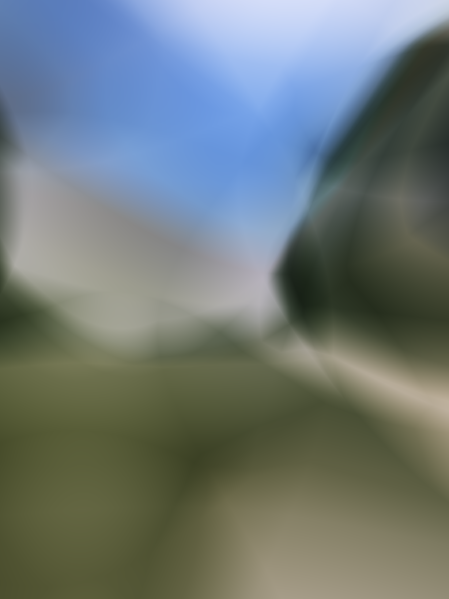
            <figcaption>L=2, Width=16: Blurry (low frequency, low capacity)</figcaption>
          </figure>
          <figure>
            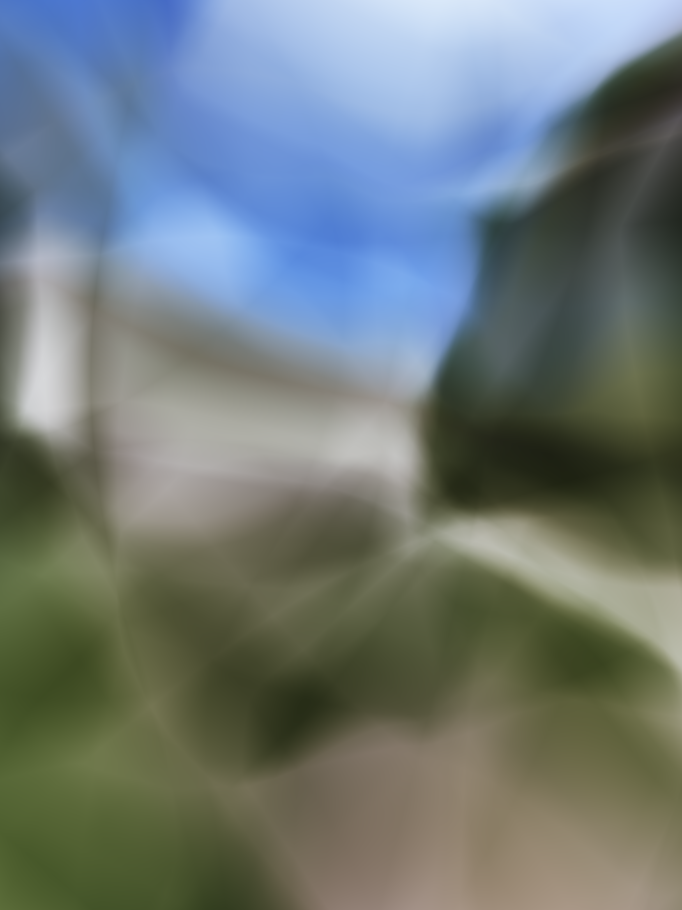
            <figcaption>L=2, Width=64: Blurry (low frequency, high capacity)</figcaption>
          </figure>
      

      

          <figure>
            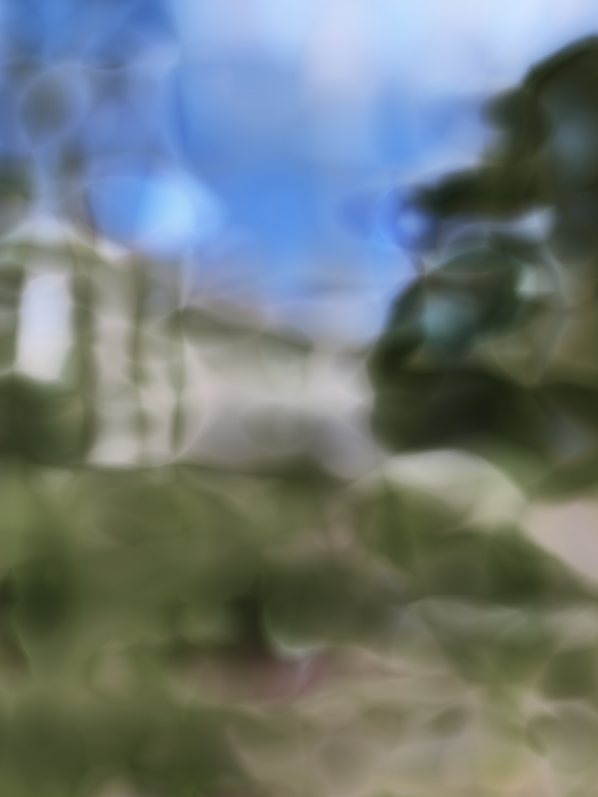
            <figcaption>L=5, Width=16: Splotchy (high frequency, low capacity)</figcaption>
          </figure>
          <figure>
            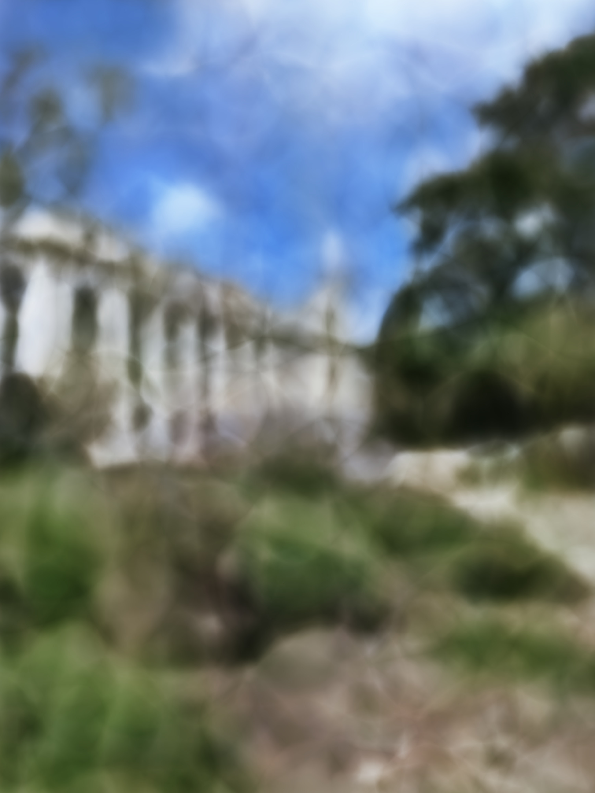
            <figcaption>L=5, Width=64: Sharp (high frequency, high capacity)</figcaption>
          </figure>
      

      <!-- END OF NEW SECTION -->

    </section>

<!-- 
      ==================================================================
      PART 2: 3D NEURAL RADIANCE FIELD
      ==================================================================
-->
<section id="part2">
    <h2 id="part2">Part 2: Full 3D Neural Radiance Field</h2>
    

    This is the core of the project: implementing the full NeRF model. The goal is to train the 5D function <code>f(x,y,z,d) -> (r,g,b,σ)</code> that represents the entire 3D scene. The training process involves ray casting and volumetric rendering, which I implemented in four main helper functions before the main training loop.
    

<!-- NEW SECTION 2.1 -->
<section id="part2-1">
<h3>Part 2.1: Generating Rays</h3>

    The first step is to simulate the rays of light that a camera sees. For each pixel in an image, we need to calculate its corresponding 3D ray vector. This is done using the camera's intrinsic matrix <code>K</code> and its extrinsic pose <code>c2w</code> (from Part 0).

    First, we create a grid of <code>(i, j)</code> pixel coordinates. We convert these 2D pixel coordinates into 3D camera-space coordinates <code>(x_c, y_c, z_c)</code> using the intrinsics <code>K</code>. This gives us a direction vector in the camera's local reference frame.

    <code>dirs = [(i - cx)/f, (j - cy)/f, 1]</code> (Using the OpenCV <code>+Y down, +Z forward</code> convention)

    Second, we use the camera-to-world rotation matrix <code>R = c2w[:3, :3]</code> to transform these camera-space direction vectors into world-space direction vectors: <code>rays_d = dirs @ R.T</code>. The origin of all rays, <code>rays_o</code>, is simply the camera's 3D position, which is the translation vector <code>t = c2w[:3, 3]</code>.

</section>

<!-- NEW SECTION 2.2 -->
<section id="part2-2">
<h3>Part 2.2: Sampling Along Rays</h3>

    A ray is infinitely long, so we must select a finite set of points along it to query our model. My <code>sample_along_rays</code> function creates <code>N_samples</code> (e.g., 64 or 192) 3D points, linearly spaced between a <code>near</code> and <code>far</code> bound.

    <code>t_vals = linspace(near, far, N_samples)</code>

    During training, random noise is added to these <code>t_vals</code> (stratified sampling) to explore the 3D space. The final 3D points are calculated with the simple line equation: <code>pts = rays_o + t_vals * rays_d</code>.

</section>

<!-- NEW SECTION 2.3 -->
<section id="part2-3">
<h3>Part 2.3: The NeRF 3D Model</h3>

    This is the MLP itself. It's an 8-layer, 256-width network with a skip connection at the 4th layer. It's designed to take a 3D position <code>(x,y,z)</code> as input, but not the viewing direction <code>d</code>, until later.

<ol>
    <li>The <code>(x,y,z)</code> position is first fed into a <code>L=10</code> Positional Encoder.</li>
    <li>This high-dimensional vector goes through the first 8 MLP layers.</li>
    <li>The output of this is the density <code>σ</code> (which is not view-dependent) and a 256-dim feature vector.</li>
    <li>The viewing direction <code>d</code> is then fed into a separate <code>L=4</code> Positional Encoder.</li>
    <li>This encoded direction is concatenated with the feature vector and passed through one final, smaller layer to produce the view-dependent <code>(r,g,b)</code> color.</li>
</ol>
</section>

<!-- NEW SECTION 2.4 -->
<section id="part2-4">
<h3>Part 2.4: Volume Rendering</h3>

    This is the heart of NeRF. My <code>volume_render</code> function takes the stack of <code>(r,g,b,σ)</code> values for all sample points on a ray and composites them into a single, final pixel color. This is an approximation of the integral rendering equation:

    First, we calculate the opacity (<code>alpha</code>) of each sample and the <code>T</code> (transmittance, or how much light is *not* blocked by the samples in front).

    <code>α_i = 1 - exp(-σ_i * δ_i)</code>
     
    <code>T_i = Π_{j=1}^{i-1} (1 - α_j)</code>

    The weight of each sample is <code>w_i = T_i * α_i</code>. The final pixel color <code>C</code> is the weighted sum of all sample colors:

    <code>C(ray) = Σ_{i=1}^{N} w_i * c_i</code>

</section>
<!-- END OF NEW SECTIONS -->

<section id="part2-5">
<h3>Part 2.5: Lego Dataset</h3>

    First, I trained my model on the provided <code>lego_200x200.npz</code> dataset. This was a crucial step for debugging, especially for fixing the <code>get_rays</code> function. The model trained for 1001 iterations and successfully passed the 23 PSNR requirement.

<h4>Training Process (Validation Set)</h4>

    The model's performance on the validation set is shown below. The PSNR curve shows a steady climb, and the render at 1000 iterations is a high-fidelity reconstruction of the scene.

    <figure>
        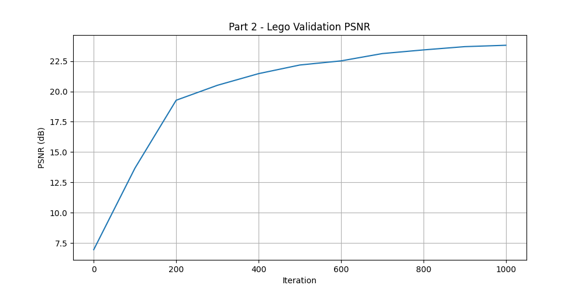
        <figcaption>Lego validation PSNR (dB) vs. Training Iterations.</figcaption>
    </figure>
    <figure>
        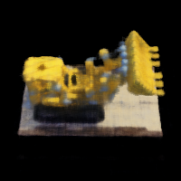
        <figcaption>Final validation render at 1000 iterations.</figcaption>
    </figure>

    <figure>
        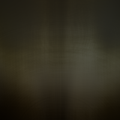
        <figcaption>Validation render at 100 iterations.</figcaption>
    </figure>
    <figure>
        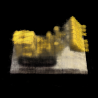
        <figcaption>Validation render at 500 iterations.</figcaption>
    </figure>
    <figure>
        
        <figcaption>Validation render at 1000 iterations.</figcaption>
    </figure>

<h4>Spherical Render</h4>

    This video shows a 360-degree spherical render from the novel test camera poses, generated by the trained NeRF.

<figure>
    <video controls autoplay muted loop>
        <source src="assets/part2/part2_lego/lego_spherical_video.mp4" type="video/mp4">
        Your browser does not support the video tag.
    </video>
    <figcaption>Spherical render of the Lego scene.</figcaption>
</figure>
</section>

<section id="part2-6">
<h3>Part 2.6: My Dataset (Plush Succulent)</h3>

    After debugging the pipeline on the Lego data, I trained a new model on my own <code>my_data.npz</code> file from Part 0. This was a significant challenge, as my dataset had a different scale, camera parameters, and a complex, non-object background (the floor).

    The biggest hurdle was that the model learned the "average" color of the scene (including the bright floor), resulting in a stuck loss and black/blurry images. The fix was to set **brutally tight** <code>NEAR_BOUND</code> and <code>FAR_BOUND</code> values (e.g., 0.45m to 0.65m) based on my calculated camera distance. This forced the model to ignore the background floor and *only* sample points on the succulent. I also increased the samples per ray to <code>N_SAMPLES = 192</code> to capture the finer details.

<h4>Training Process &amp; Loss</h4>

    I trained the model for 5000 iterations. Unlike the Lego set, I'm plotting the training **loss curve** (as PSNR is not available). You can see the loss decrease as the model learns. The intermediate renders show the object emerging from a blurry void.

    <figure>
        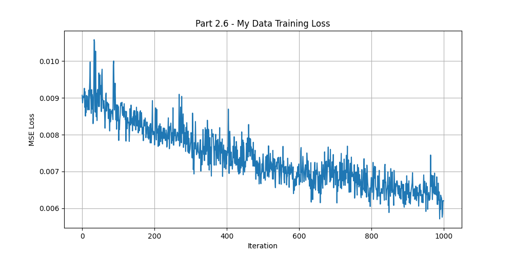
        <figcaption>Training Loss vs. Iterations for the succulent scene.</figcaption>
    </figure>
    <figure>
        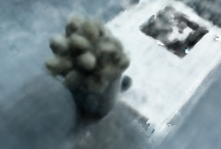
        <figcaption>Final validation render at 5000 iterations.</figcaption>
    </figure>

    <figure>
        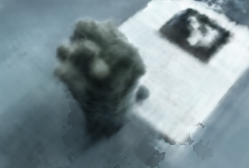
        <figcaption>Validation render at 500 iterations.</figcaption>
    </figure>
    <figure>
        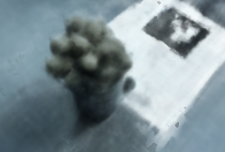
        <figcaption>Validation render at 2000 iterations.</figcaption>
    </figure>
    <figure>
        
        <figcaption>Validation render at 5000 iterations.</figcaption>
    </figure>

<h4>Final Render GIF</h4>

    Finally, I rendered a 360-degree orbit around my object. Finding the correct render path was a challenge. The test poses in the <code>.npz</code> file were buggy, so I had to write a new "look-at" function to generate a correct circular path around my object's estimated center (which was at <code>[0, -0.5, 0]</code>, not the origin). The final GIF shows the successful 3D reconstruction.

<figure>
    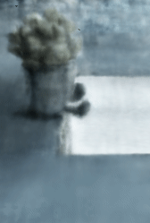
    <figcaption>Final 360-degree render of the plush succulent.</figcaption>
</figure>
</section>
</section>

<section id="reflection">
    <h2 id="reflection">Reflection</h2>
    

        This project was a fantastic (and very challenging) dive into 3D computer vision. The gap between the 2D "warm-up" and the full 3D NeRF was significant, and I spent a great deal of time debugging the pipeline. The most difficult part was unquestionably the data: a tiny mismatch in coordinate systems (OpenCV vs. OpenGL) or a failure to save the *exact* camera matrix <code>K</code> from Part 0 resulted in a model that simply wouldn't learn.
    

    

        The most confused moment came from debugging my own dataset. Seeing the loss stuck at 0.3 and the renders coming out black was incredibly frustrating, but it forced me to understand the pipeline from start to finish. The bug wasn't in the complex NeRF model, but in the data pipeline: my <code>load_data_and_rays</code> function was *guessing* the camera's principal point (<code>W/2, H/2</code>) instead of using the *real* one I had already calculated in Part 0. Fixing this by saving the full <code>K</code> matrix from Part 0 and loading it in Part 2 was what finally made the model converge.
    

    

        Overall, this project was a lesson in how sensitive deep learning models are to their input data. Seeing the final GIF render after all that debugging was one of the most rewarding moments of the class.
    

</section>

</body>
</html>