    <h1>Project 5: Fun with Diffusion Models!</h1>
    
Part A: The Power of Diffusion &nbsp;|&nbsp; Part B: Diffusion from Scratch

    <section id="overview">
        <h2>Overview</h2>
        

            This project explores the inner workings of Denoising Diffusion Probabilistic Models (DDPMs). 
            In <strong>Part A</strong>, I experimented with a pre-trained state-of-the-art model (DeepFloyd IF), "hacking" its sampling loop to perform tasks it wasn't explicitly trained for, like optical illusions and image editing.
            In <strong>Part B</strong>, I built a diffusion model from scratch, training a U-Net on MNIST to generate handwritten digits using Flow Matching.
        

    </section>

    <!-- ================================================================================== -->
    <!-- PART A -->
    <!-- ================================================================================== -->
    
    <h1>Part A: The Power of Diffusion Models</h1>

    <section id="part0">
        <h2>Part 0: Setup & Generation</h2>
        

            I started by setting up the DeepFloyd IF (Stage I) model. This is a text-to-image diffusion model that operates in pixel space. 
            The core idea is to convert a text prompt into embeddings (using T5-XXL) and guide the iterative denoising process.
        

        
<strong>Random Seed:</strong> 42

        
I tested the model with "High Quality" vs "Low Quality" sampling steps (50 vs 10). More steps generally yield cleaner textures.

        

            <figure>
            
            <figcaption>Futuristic city with neon lights (Steps 10)</figcaption>
            </figure>
            <figure>
            
            <figcaption>Futuristic city with neon lights (Steps 50)</figcaption>
            </figure>
        

            

            <figure>
            
            <figcaption>Cute corgi astronaut on the moon (Steps 10)</figcaption>
            </figure>
            <figure>
            
            <figcaption>Cute corgi astronaut on the moon (Steps 50)</figcaption>
            </figure>
        

            

            <figure>
            
            <figcaption>Delicious plate of sushi (Steps 10)</figcaption>
            </figure>
            <figure>
            
            <figcaption>Delicious plate of sushi (Steps 50)</figcaption>
            </figure>
        

    </section>

    <section id="part1">
        <h2>Part 1: Sampling Loops</h2>
        

            Instead of using the library's `pipeline()`, I manually implemented the diffusion loop to understand the math.
            The diffusion process assumes an image $x_0$ is slowly destroyed by noise to become $x_T$. Our goal is to reverse this: $p_\theta(x_{t-1} | x_t)$.
        

        <section id="part1-1">
        <h3>1.1 Forward Process</h3>
        

            The forward process adds Gaussian noise according to a schedule $\bar{\alpha}_t$. 
            At $t=750$, the image is mostly noise.
        

        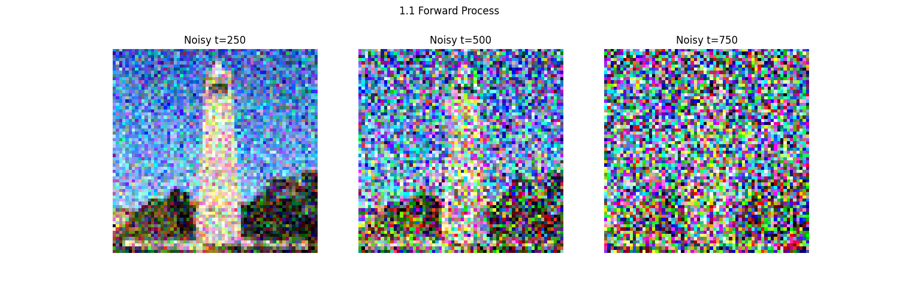
        </section>
        <section id="part1-2">
        <h3>1.2 Classical Denoising</h3>
        

            Can we just blur out the noise? No. Gaussian blur removes the high-frequency noise but also destroys the high-frequency details (edges, textures). The result is a blurry mess.
        

        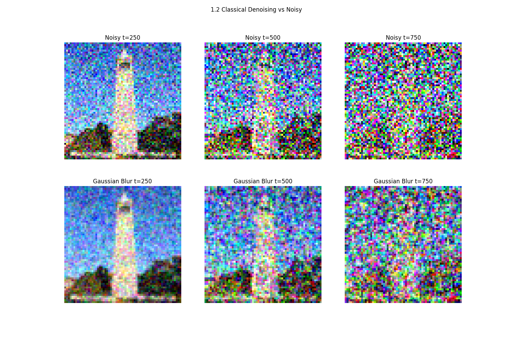
        </section>
        <section id="part1-3">
        <h3>1.3 One-Step Denoising</h3>
        

            Here, I asked the Neural Network to predict the original image $x_0$ in a single step given noisy input $x_t$.
            Although it fails to recover fine textures because the "jump" from pure noise to a clean image is too difficult, it captures the global structure (the tower shape). The result is better than blurring, but can we do better?
        

        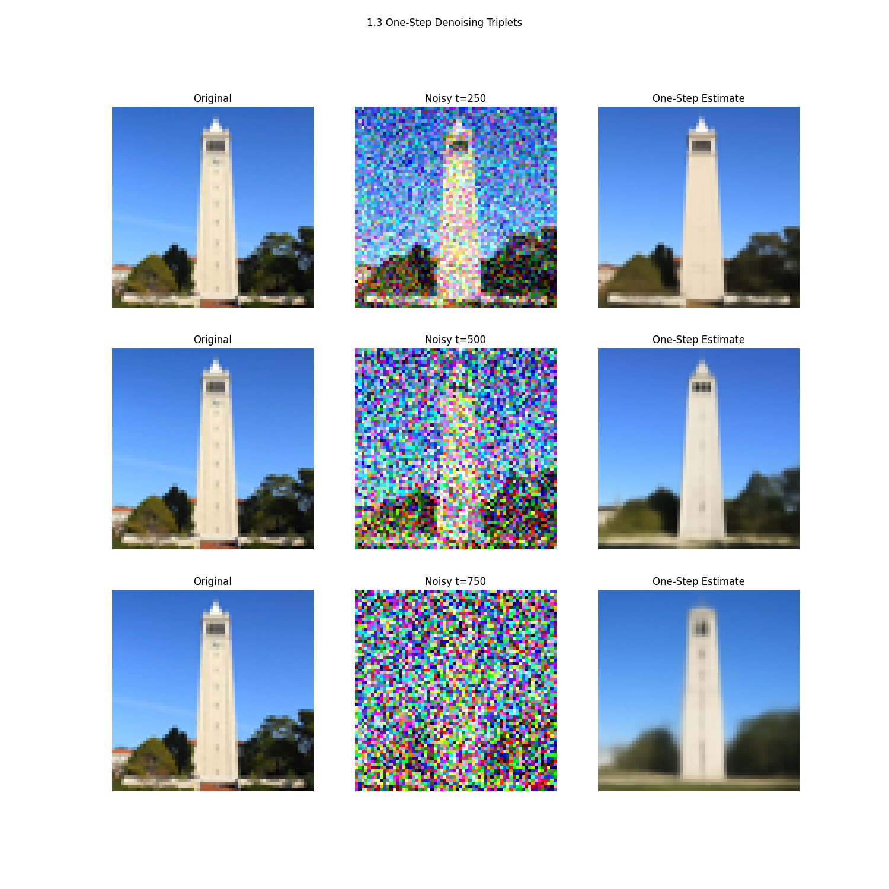
        </section>
        <section id="part1-4">
        <h3>1.4 Iterative Denoising</h3>
        

            The core philosophy of diffusion models is that while reversing the entire noise process in one step is mathematically impossible (too much information is lost), reversing a <em>tiny</em> amount of noise is tractable. By breaking the denoising process into many small steps (iterative denoising), the model can gradually "hallucinate" structure, refining a blurry blob into a sharp image. In this project, I implemented a strided sampling schedule, skipping steps to speed up inference while carefully re-injecting noise to maintain stochasticity.
        

        
<strong>Intermediate Progress (Every 5th Step):</strong>

        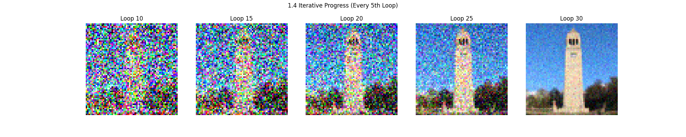
        <h3>Comparison: Iterative vs One-Step vs Gaussian</h3>
        
The iterative method (left) is the only one that produces a sharp, realistic image.

        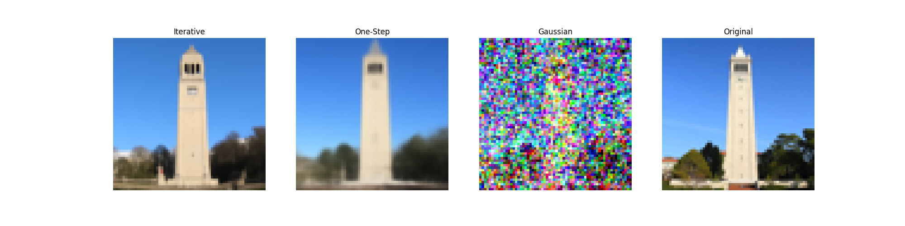
        </section>
        <section id="part1-5">
        <h3>1.5 Diffusion Model Sampling</h3>
        

            If we start with pure noise (instead of a noisy Campanile) and run the iterative loop, we generate new images!
        

        

            <article class="card"><figure>
            
            </figure></article>
            <article class="card"><figure>
            
            </figure></article>
            <article class="card"><figure>
            
            </figure></article>
            <article class="card"><figure>
            
            </figure></article>
            <article class="card"><figure>
            
            </figure></article>
        

        </section>
        <section id="part1-6">
        <h3>1.6 Classifier-Free Guidance (CFG)</h3>
        

            <strong>Classifier-Free Guidance (CFG)</strong> is the secret sauce behind the high fidelity of modern diffusion models. A standard conditional model often produces safe, generic images that only weakly adhere to the prompt. CFG forces the model to pay attention by computing two noise estimates: one conditioned on the text prompt ($\epsilon_c$) and one unconditional ($\epsilon_u$). We then extrapolate the difference: $\epsilon_{final} = \epsilon_u + \gamma(\epsilon_c - \epsilon_u)$. By setting $\gamma > 1$, we push the generated image away from generic features and towards the specific characteristics described in the prompt.
        

        

            <article class="card"><figure>
            
            </figure></article>
            <article class="card"><figure>
            
            </figure></article>
            <article class="card"><figure>
            
            </figure></article>
            <article class="card"><figure>
            
            </figure></article>
            <article class="card"><figure>
            
            </figure></article>
        

        
 You can see the images are more detailed and colorful right now. 

        </section>
    </section>

    <section id="part1-7">
        <h2>Part 1.7: Image-to-Image Translation (SDEdit)</h2>
        

            In this part, we explore the "SDEdit" algorithm. The intuition is simple: we take a real image, add a specific amount of noise to it, and then run the denoising process. 
        

        

            Adding noise effectively pushes the image "off" the manifold of natural images. When the diffusion model denoises it, it forces the image back onto the manifold.
            If we add a <strong>small amount of noise</strong> (low `i_start`), the model just "cleans up" the image, keeping it very close to the original. 
            If we add a <strong>large amount of noise</strong> (high `i_start`), the model has to hallucinate new details to make it look like a natural image again, resulting in larger edits.
        

        <h3>Campanile SDEdit</h3>
        
Here, I force the noisy Campanile back onto the manifold of "a high quality photo". Notice how at <code>i=20</code>, the model hallucinates a completely different tower structure.

        

            <article class="card"><figure><figcaption>Original</figcaption></figure></article>
            <article class="card"><figure><figcaption>i_start=1</figcaption></figure></article>
            <article class="card"><figure><figcaption>i_start=3</figcaption></figure></article>
            <article class="card"><figure><figcaption>i_start=5</figcaption></figure></article>
            <article class="card"><figure><figcaption>i_start=7</figcaption></figure></article>
            <article class="card"><figure><figcaption>i_start=10</figcaption></figure></article>
            <article class="card"><figure><figcaption>i_start=20</figcaption></figure></article>
        

        <h3>Custom Image 1 SDEdit</h3>
        

            <article class="card"><figure><figcaption>Original</figcaption></figure></article>
            <article class="card"><figure><figcaption>i_start=1</figcaption></figure></article>
            <article class="card"><figure><figcaption>i_start=3</figcaption></figure></article>
            <article class="card"><figure><figcaption>i_start=5</figcaption></figure></article>
            <article class="card"><figure>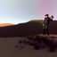<figcaption>i_start=7</figcaption></figure></article>
            <article class="card"><figure><figcaption>i_start=10</figcaption></figure></article>
            <article class="card"><figure><figcaption>i_start=20</figcaption></figure></article>
        

        <h3>Custom Image 2 SDEdit</h3>
        

            <article class="card"><figure><figcaption>Original</figcaption></figure></article>
            <article class="card"><figure><figcaption>i_start=1</figcaption></figure></article>
            <article class="card"><figure><figcaption>i_start=3</figcaption></figure></article>
            <article class="card"><figure><figcaption>i_start=5</figcaption></figure></article>
            <article class="card"><figure><figcaption>i_start=7</figcaption></figure></article>
            <article class="card"><figure><figcaption>i_start=10</figcaption></figure></article>
            <article class="card"><figure><figcaption>i_start=20</figcaption></figure></article>
        

    </section>

    <section id="part1-7-1">
        <h3>1.7.1 Web & Hand-Drawn Images</h3>
        

            This technique is especially powerful for "projecting" sketches or non-realistic images onto the natural image manifold.
            The model treats the sketch as a "noisy" version of a real object and "denoises" it into a realistic photo.
        

        <h4>Web Image</h4>
        

            <article class="card"><figure><figcaption>Original</figcaption></figure></article>
            <article class="card"><figure><figcaption>i_start=1</figcaption></figure></article>
            <article class="card"><figure><figcaption>i_start=3</figcaption></figure></article>
            <article class="card"><figure><figcaption>i_start=5</figcaption></figure></article>
            <article class="card"><figure><figcaption>i_start=7</figcaption></figure></article>
            <article class="card"><figure><figcaption>i_start=10</figcaption></figure></article>
            <article class="card"><figure><figcaption>i_start=20</figcaption></figure></article>
        

        <h4>Hand Drawn 1</h4>
        

            <article class="card"><figure><figcaption>Original</figcaption></figure></article>
            <article class="card"><figure><figcaption>i_start=1</figcaption></figure></article>
            <article class="card"><figure><figcaption>i_start=3</figcaption></figure></article>
            <article class="card"><figure><figcaption>i_start=5</figcaption></figure></article>
            <article class="card"><figure><figcaption>i_start=7</figcaption></figure></article>
            <article class="card"><figure><figcaption>i_start=10</figcaption></figure></article>
            <article class="card"><figure><figcaption>i_start=20</figcaption></figure></article>
        

        <h4>Hand Drawn 2</h4>
        

            <article class="card"><figure><figcaption>Original</figcaption></figure></article>
            <article class="card"><figure><figcaption>i_start=1</figcaption></figure></article>
            <article class="card"><figure><figcaption>i_start=3</figcaption></figure></article>
            <article class="card"><figure><figcaption>i_start=5</figcaption></figure></article>
            <article class="card"><figure><figcaption>i_start=7</figcaption></figure></article>
            <article class="card"><figure><figcaption>i_start=10</figcaption></figure></article>
            <article class="card"><figure><figcaption>i_start=20</figcaption></figure></article>
        

    </section>

    <section id="part1-7-2">
        <h3>1.7.2 Inpainting</h3>
        

            Inpainting uses a mask to define "keep" regions and "generate" regions. 
            At each step of the denoising loop, we replace the "keep" pixels with the original image (plus appropriate noise for that step). This forces the model to generate new content only inside the mask, while ensuring it blends seamlessly with the surroundings.
        

        

            <article class="card"><figure><figcaption>Original Campanile</figcaption></figure></article>
            <article class="card"><figure><figcaption>Mask (Edit Top)</figcaption></figure></article>
            <article class="card"><figure><figcaption>Inpainted Result</figcaption></figure></article>
        

        
        

            <article class="card"><figure><figcaption>Custom 1 Original</figcaption></figure></article>
            <article class="card"><figure><figcaption>Inpainted Result</figcaption></figure></article>
        

        

            <article class="card"><figure><figcaption>Custom 2 Original</figcaption></figure></article>
            <article class="card"><figure><figcaption>Inpainted Result</figcaption></figure></article>
        

    </section>

    <section id="part1-7-3">
        <h3>1.7.3 Text-Conditional Editing</h3>
        

            This is the same SDEdit process as 1.7, but instead of projecting onto the generic manifold of "high quality photos", we guide the projection with a specific text prompt.
            Here, I prompt the model with <strong>"a rocket ship"</strong>. As the noise level increases, the Campanile gradually morphs into a rocket.
        

        <h4>Campanile &rarr; "A Rocket Ship"</h4>
        

            <article class="card"><figure><figcaption>Original</figcaption></figure></article>
            <article class="card"><figure><figcaption>i_start=1</figcaption></figure></article>
            <article class="card"><figure><figcaption>i_start=3</figcaption></figure></article>
            <article class="card"><figure><figcaption>i_start=5</figcaption></figure></article>
            <article class="card"><figure><figcaption>i_start=7</figcaption></figure></article>
            <article class="card"><figure><figcaption>i_start=10</figcaption></figure></article>
            <article class="card"><figure><figcaption>i_start=20</figcaption></figure></article>
        

        <h4>Custom 1 &rarr; "A Rocket Ship"</h4>
        

            <article class="card"><figure><figcaption>Original</figcaption></figure></article>
            <article class="card"><figure><figcaption>i_start=1</figcaption></figure></article>
            <article class="card"><figure><figcaption>i_start=3</figcaption></figure></article>
            <article class="card"><figure><figcaption>i_start=5</figcaption></figure></article>
            <article class="card"><figure><figcaption>i_start=7</figcaption></figure></article>
            <article class="card"><figure><figcaption>i_start=10</figcaption></figure></article>
            <article class="card"><figure><figcaption>i_start=20</figcaption></figure></article>
        

        <h4>Custom 2 &rarr; "A Rocket Ship"</h4>
        

            <article class="card"><figure><figcaption>Original</figcaption></figure></article>
            <article class="card"><figure><figcaption>i_start=1</figcaption></figure></article>
            <article class="card"><figure><figcaption>i_start=3</figcaption></figure></article>
            <article class="card"><figure><figcaption>i_start=5</figcaption></figure></article>
            <article class="card"><figure><figcaption>i_start=7</figcaption></figure></article>
            <article class="card"><figure><figcaption>i_start=10</figcaption></figure></article>
            <article class="card"><figure><figcaption>i_start=20</figcaption></figure></article>
        

    </section>

    <section id="part1-8">
        <h2>Part 1.8: Visual Anagrams</h2>
        

            In this section, I create optical illusions called "Visual Anagrams." These are images that look like one thing when viewed upright, but something completely different when flipped upside down.
        

        

            To achieve this, I modified the sampling loop to satisfy two constraints simultaneously. At each timestep $t$, I computed the noise estimate for the upright image using the first prompt $p_1$. Then, I flipped the image, computed the noise estimate for the second prompt $p_2$, and flipped that noise back. The final noise update is the average of these two estimates.
        

        

            $$ \epsilon_1 = \text{UNet}(x_t, t, p_1) $$
            $$ \epsilon_2 = \text{flip}(\text{UNet}(\text{flip}(x_t), t, p_2)) $$
            $$ \epsilon_{final} = (\epsilon_1 + \epsilon_2) / 2 $$
        

        

            

                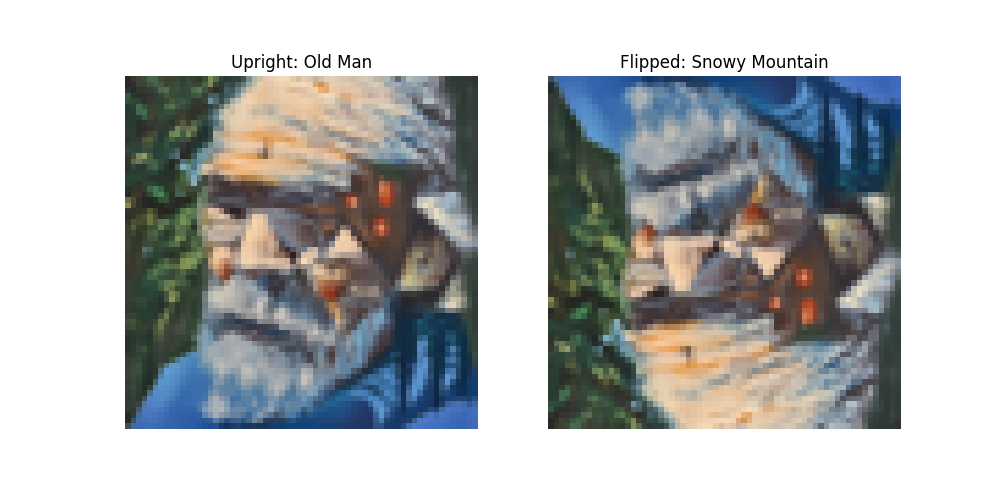
                <figcaption>Upright: "An Oil Painting of an Old Man"   Flipped: "An Oil Painting of People Around a Campfire"</figcaption>
            

            

                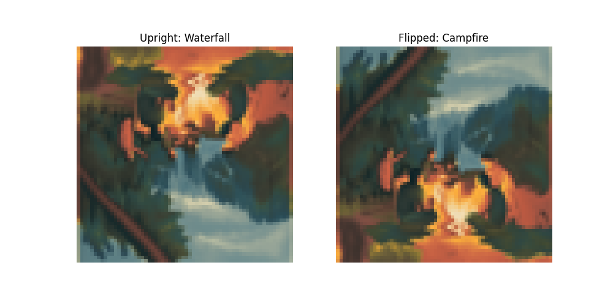
                <figcaption>Upright: "A Lithograph of a Waterfall"   Flipped: "A Lithograph of a Skull"</figcaption>
            

        

    </section>

    <section id="part1-9">
        <h2>Part 1.9: Hybrid Images</h2>
        

            Here, I implemented Factorized Diffusion to create "Hybrid Images": images that change interpretation based on viewing distance. This works by combining the low-frequency components of one image with the high-frequency components of another.
        

        

            Similar to the anagrams, I computed two noise estimates. I then applied a low-pass filter (Gaussian blur) to the first estimate and a high-pass filter (Identity minus Gaussian blur) to the second. Summing these creates a hybrid noise vector that guides the diffusion process to generate the composite image.
        

        

            $$ \epsilon_1 = \text{UNet}(x_t, t, p_1) $$
            $$ \epsilon_2 = \text{UNet}(x_t, t, p_2) $$
            $$ \epsilon_{final} = \text{LowPass}(\epsilon_1) + \text{HighPass}(\epsilon_2) $$
        

        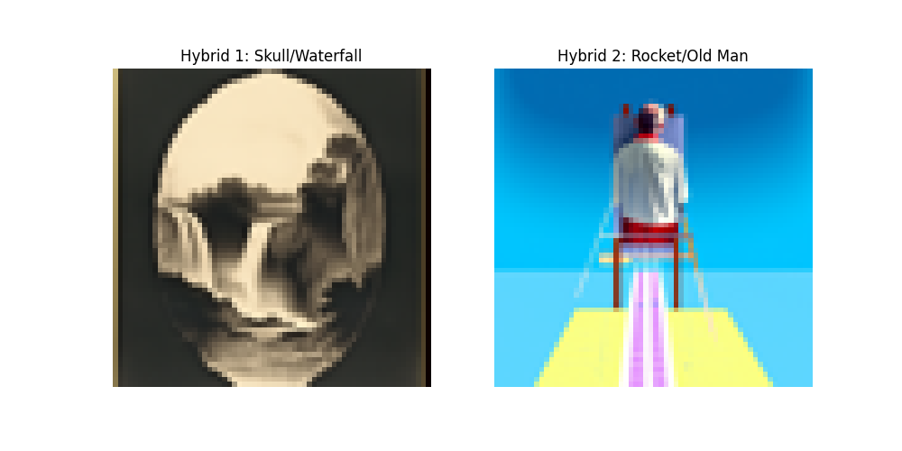
        <figcaption>Left: Skull (Low Freq) + Waterfall (High Freq). Right: Old Man (Low Freq) + Campfire (High Freq).</figcaption>
    </section>

    <!-- ================================================================================== -->
    <!-- PART B -->
    <!-- ================================================================================== -->

    <h1>Part B: Diffusion from Scratch (Flow Matching)</h1>

    <section id="partB-part1">
        <h2>Part 1: Training a Single-Step Denoising UNet</h2>
        

            In Part B, we shift from using a pre-trained model to training our own diffusion model on the MNIST dataset. 
            We start by implementing a U-Net architecture and training it as a simple one-step denoiser.
        

        <h3>1.1 Implementing the UNet</h3>
        

            The heart of our diffusion model is the U-Net. It consists of downsampling blocks, a bottleneck, and upsampling blocks with skip connections. 
            Crucially, we build it using "atomic" operations like <code>Conv2d</code>, <code>GELU</code>, and <code>AvgPool</code>.
        

        

            <figure>
                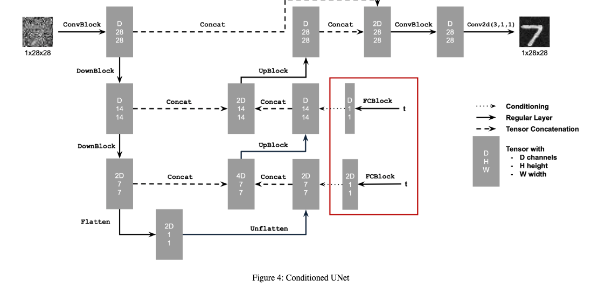
                <figcaption>The Unconditional UNet architecture.</figcaption>
            </figure>
            <figure>
                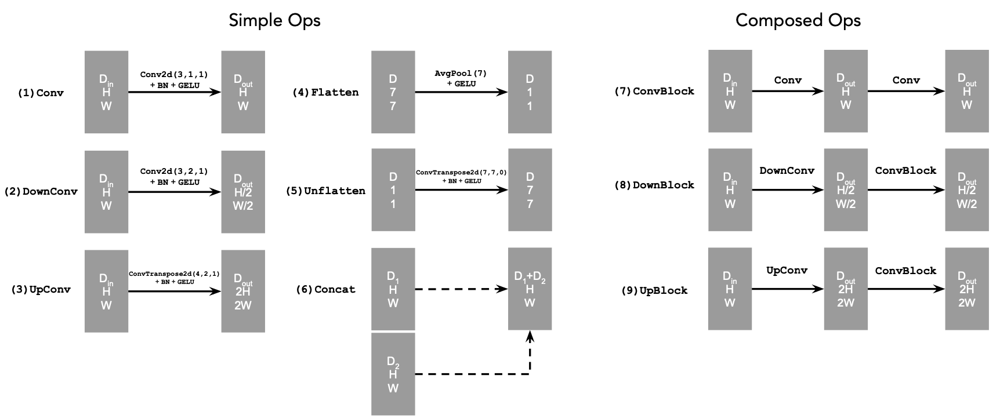
                <figcaption>Standard Operations used in the blocks.</figcaption>
            </figure>
        

        <h3>1.2 Using the UNet to Train a Denoiser</h3>
        

            We visualize the noising process $z = x + \sigma \epsilon$. As $\sigma$ increases, the digits become indistinguishable from noise.
        

        <figure>
            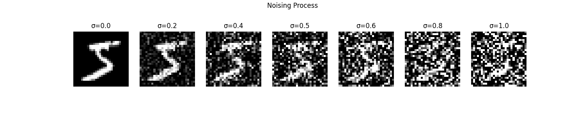
            <figcaption>Noising process with increasing sigma.</figcaption>
        </figure>
        <h4>1.2.1 Training</h4>
        

            I trained the model to map noisy images ($z$, $\sigma=0.5$) back to clean images ($x$).
        

        

            <figure>
                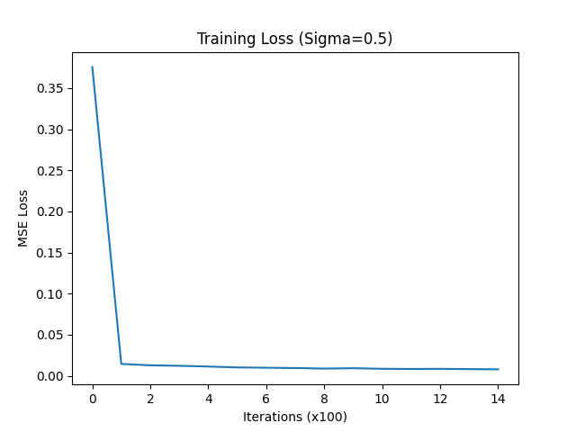
                <figcaption>Training Loss (MSE)</figcaption>
            </figure>
            <figure>
                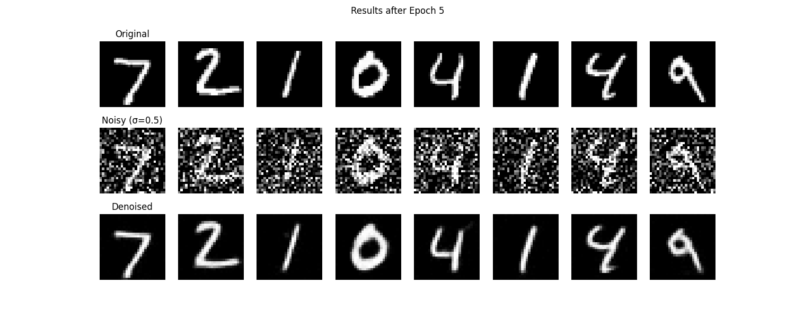
                <figcaption>Denoising results on the test set after 5 epochs.</figcaption>
            </figure>
        

        <h4>1.2.2 Out-of-Distribution Testing</h4>
        

            The model was trained on $\sigma=0.5$. When tested on other noise levels, it struggles. At $\sigma=1.0$ (pure noise), it fails to generate a clean digit, showing that it hasn't learned to generate from scratch.
        

        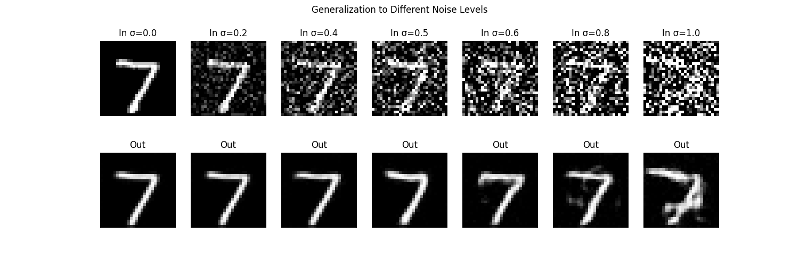
        <h4>1.2.3 Denoising Pure Noise</h4>
        

            If we train the model explicitly to map pure noise ($\sigma=1.0$) to clean images, it learns to output the "average" dataset image (a blurry generic digit) rather than a specific digit. This is because the MSE loss is minimized by the mean of the distribution when the input (noise) contains no information about the target.
        

        

            <figure>
                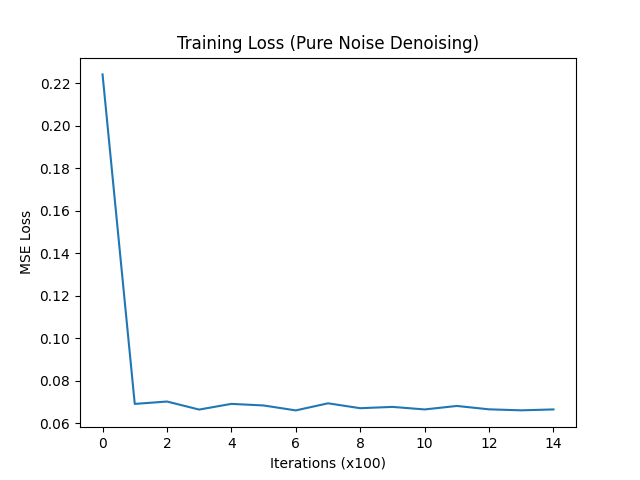
                <figcaption>Loss curve for pure noise training.</figcaption>
            </figure>
            <figure>
                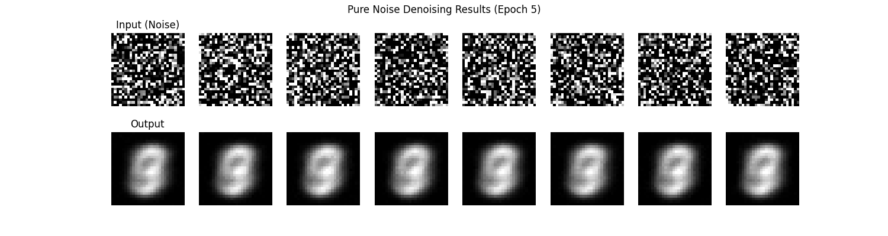
                <figcaption>The model outputs blurry "average" digits.</figcaption>
            </figure>
        

    </section>

    <section id="partB-part2">
        <h2>Part 2: Training a Flow Matching Model</h2>
        

            To generate high-quality images, we use <strong>Flow Matching</strong>. Instead of predicting the image directly, we predict the <em>velocity</em> vector field that transforms noise into data over time $t \in [0, 1]$.
        

        

            We define a path $x_t = (1-t)x_0 + t x_1$. The target velocity is simply $u_t = x_1 - x_0$. The model learns to predict this direction given the current noisy state $x_t$ and the time $t$.
        

        <h3>2.1 Adding Time Conditioning to UNet</h3>
        

            I modified the UNet to accept a scalar time $t$, injecting it into the network using Fully Connected Blocks (FCBlocks) that scale the feature maps.
        

        

            <figure>
                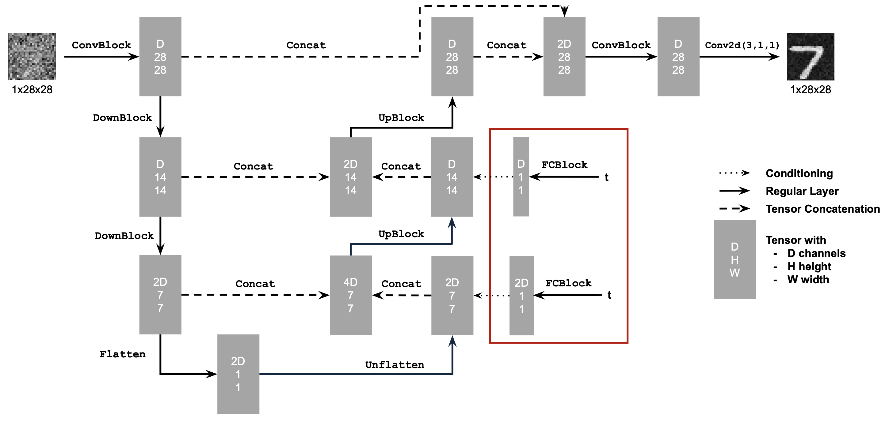
                <figcaption>The Time-Conditioned UNet architecture.</figcaption>
            </figure>
            <figure>
                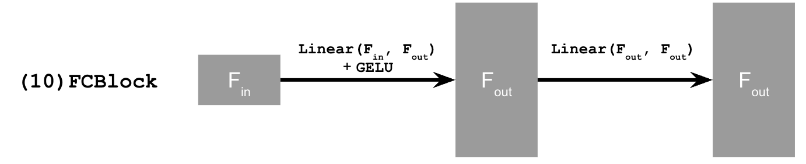
                <figcaption>FCBlock structure.</figcaption>
            </figure>
        

        <h3>2.2 Training the UNet</h3>
        

            The model is trained to minimize the MSE between its predicted flow $v_t$ and the ground truth flow $x_1 - x_0$.
        

        <figure>
            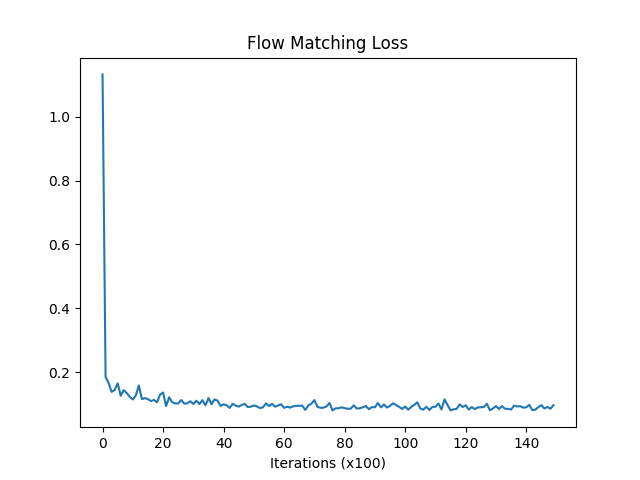
            <figcaption>Training Loss for Flow Matching.</figcaption>
        </figure>
        <h3>2.3 Sampling from the UNet</h3>
        

            To sample, we start with pure noise at $t=0$ and numerically integrate the predicted velocity field (using Euler's method) to reach $t=1$.
        

        

            

                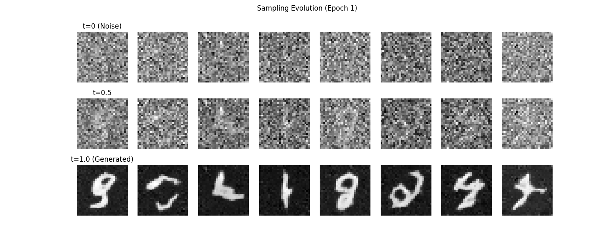
                <figcaption>Epoch 1</figcaption>
            

            

                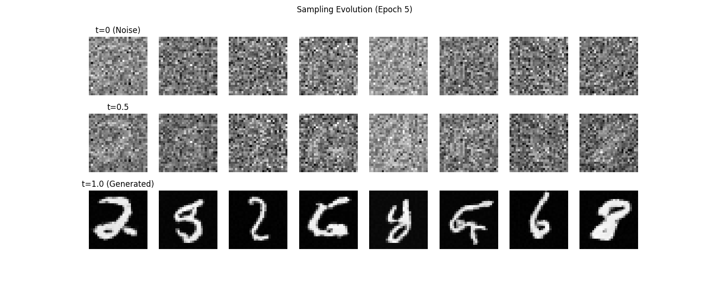
                <figcaption>Epoch 5</figcaption>
            

            

                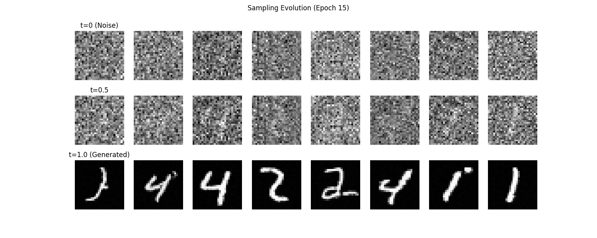
                <figcaption>Epoch 15 (Final)</figcaption>
            

        

    </section>

    <section id="partB-part2-class">
        <h3>2.4 Adding Class-Conditioning</h3>
        

            To control which digit is generated, I added class conditioning. I inject a one-hot vector of the class label into the UNet, similar to the time embedding.
        

        <h3>2.5 Training the UNet</h3>
        

            I trained the model with Classifier-Free Guidance (CFG) by randomly dropping the class label 10% of the time. This allows the model to learn both conditional and unconditional distributions.
        

        <figure>
            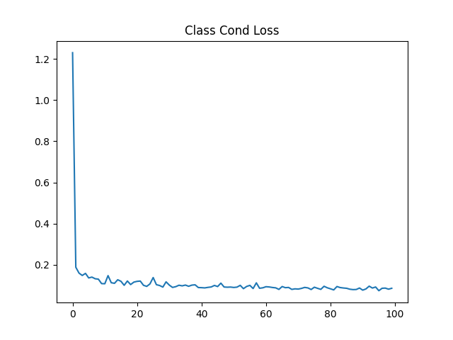
            <figcaption>Loss curve for Class-Conditioned Flow Matching.</figcaption>
        </figure>
        <h3>2.6 Sampling (Class Conditioned)</h3>
        

            Using CFG ($\gamma > 1$), we generate specific digits. The results are sharper and more consistent than the unconditional model.
        

        

            

                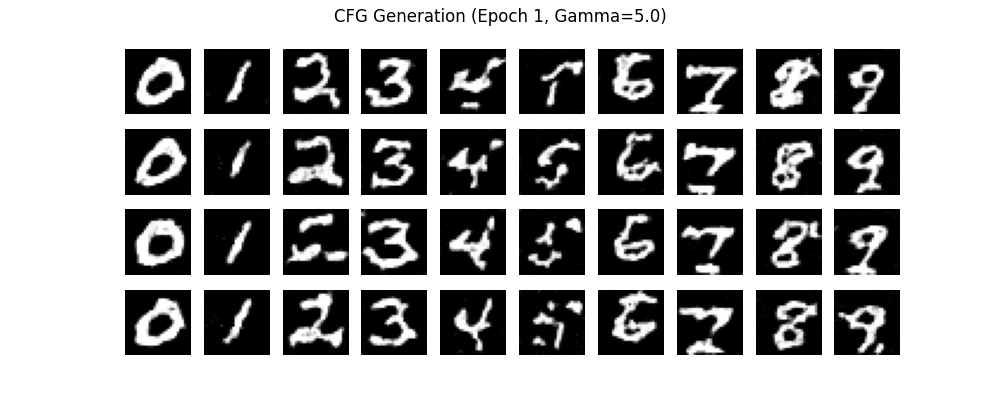
                <figcaption>Epoch 1</figcaption>
            

            

                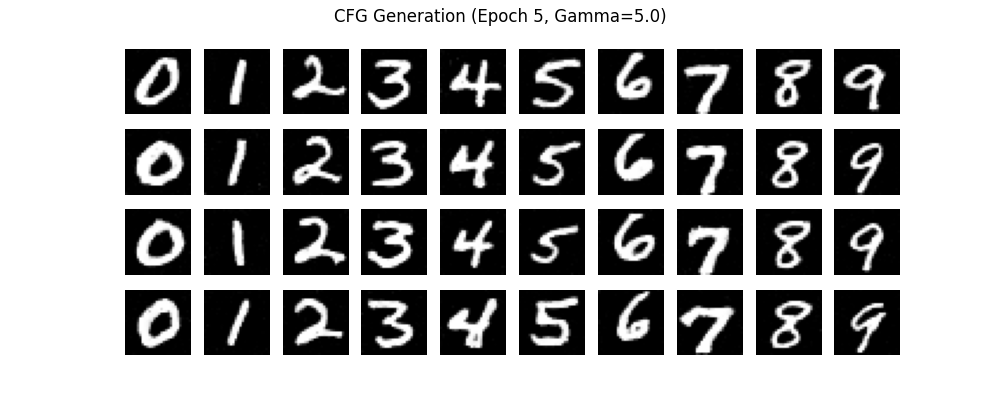
                <figcaption>Epoch 5</figcaption>
            

            

                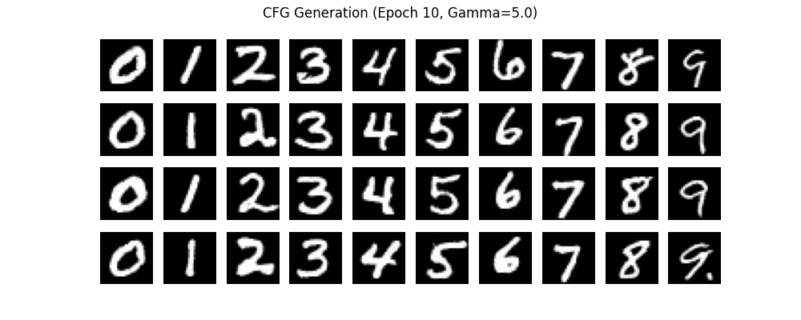
                <figcaption>Epoch 10 (Final)</figcaption>
            

        

        <h3>Experiment: Removing the Learning Rate Scheduler</h3>
        

            A question may come up: "Can we get rid of the annoying learning rate scheduler?" 
            I experimented by training the model with a constant learning rate of <code>1e-3</code> (a middle ground between the scheduler's start and end). As shown below, the model still converges successfully to a similar loss and visual quality, suggesting that while the scheduler is helpful for optimization, it is not strictly necessary for this specific task.
        

        

            <figure>
                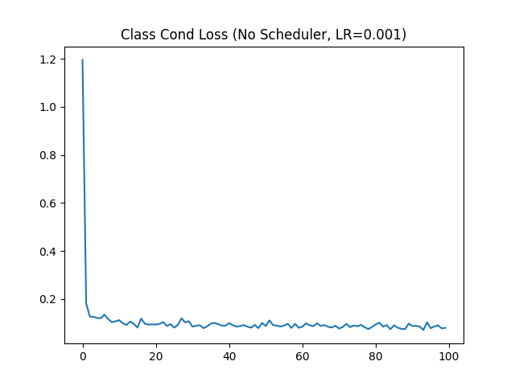
                <figcaption>Loss curve without scheduler.</figcaption>
            </figure>
            <figure>
                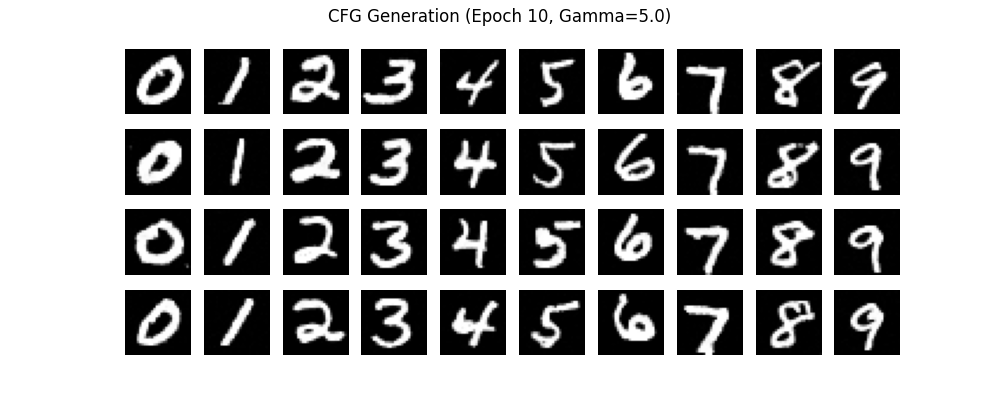
                <figcaption>Generated digits (No Scheduler).</figcaption>
            </figure>
        

    </section>